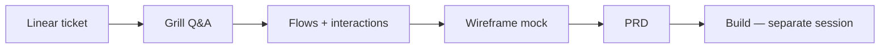

# prd-tests

**Product research workflow experiments** — each branch is one agent run of the **grill-before-build** pipeline. The branch README is a **senior PM/PD case study with evidence**, not the PRD itself and not a bullet dump.

This repo tests whether an agent workflow (grill → flows → mock → PRD) produces build-ready product artifacts **before any code is written**. We evaluate **output quality and workflow fidelity**, not whether the underlying product ideas are good business.

---

## How to read a case study

Each branch README follows a narrative case-study structure. A lay product person should be able to read one branch top-to-bottom and understand **what was tested, what got locked, and whether they'd green-light build**.

| Section | What you'll find |
|---------|------------------|
| **Metadata table** | Linear ticket, repo, branch, date, status (PLANNING / BUILD / SHIPPED) |
| **Executive summary** | 3-sentence verdict |
| **The bet** | Which workflow hypothesis this run tests |
| **Session narrative** | Pivotal Q&A exchanges with quoted decisions and why they mattered |
| **Flow walkthrough** | Plain-English summary of Mermaid diagrams (full diagrams in `artifacts/flows.md`) |
| **Interaction design** | 2–3 options + pick pattern with IA/app-logic rationale |
| **Wireframe review** | Embedded screenshots with captions explaining what each proves |
| **PRD resume** | Key What/Why/AC sections inline (full PRD stays in LoudEcho monorepo) |
| **UX fidelity** *(dara-front runs)* | Honest comparison of wireframes vs real component patterns |
| **Right / wrong** | What the agent got right and weak spots |
| **Critique verdict** | Superb or subpar — **with evidence**, skeptical but fair |
| **Ratings table** | Scored dimensions (see rubric below) |
| **Appendix** | Artifact index |

**Important:** Case studies judge **agent output quality** (clarity, scope discipline, buildability, traceability, UX fidelity). They do not evaluate product-market fit.

---

## Rating rubric (1–5)

Scores appear at the end of every branch case study.

| Dimension | 1 — Poor | 3 — Adequate | 5 — Excellent |
|-----------|----------|--------------|---------------|
| **Clarity added before build** | Major ambiguities remain; builder would re-discover scope in code | Core happy path locked; some open questions | Decisions traceable; ACs map to grill log; open questions explicit and few |
| **Grounding in design skill stack / IA / app logic** | Wireframes invent foreign UI; ignores existing nav/tabs/components | Extends real IA; wireframes structural only | Reads target repo UX before mock; references real component names; wireframes use repo tokens/patterns |
| **UX best practices / approach quality** | No error states; no option matrices; pixel debate in grill | Flows + key interactions documented; layout gate passed | Edge-state table; 2–3 options + rationale per step; isolation/accessibility considered |
| **Build readiness** | PRD not buildable; hidden backend deps; contract changes smuggled in | Buildable with conditions; stub seams or scope chop noted | Clear ACs, additive-only contracts, stub/backend seam explicit, P1 chop if needed |
| **Overall workflow grade** | Re-grill required | Approve with conditions | Approve; workflow superb |

---

## Workflow under test



**Pipeline steps:**

1. **Grill** — structured Q&A locks product decisions (`grill-me-product` skill + MVP stop rules)
2. **Flows** — Mermaid diagrams + interaction option matrices (logic only, no pixel debate)
3. **Mock** — low-fi wireframes (Pencil or HTML fallback) → PNG screenshots; must extend existing repo IA
4. **PRD** — Shape Up structure with acceptance criteria traceable to grill decisions
5. **Build** — intentionally out of scope for control-arm branches (planning-phase audits)

Agent prompt: [`prompts/grill-before-build-agent-prompt.md`](prompts/grill-before-build-agent-prompt.md) (also in LoudEcho monorepo at `docs/case-studies/grill-before-build-agent-prompt.md`).

---

## Branch naming

```
{TICKET}-{Variant}
```

| Part | Meaning | Example |
|------|---------|---------|
| `TICKET` | Linear ID, no hyphen | `ENG1410`, `ENG1409` |
| `Variant` | Experiment arm | `Control` (standard prompt), `Skill-Test` (alternate skill stack) |

| Branch | Ticket | Variant | Status |
|--------|--------|---------|--------|
| [`ENG1410-Control`](tree/ENG1410-Control) | ENG-1410 Creative Library | Control arm | PLANNING complete |
| [`ENG1409-Control`](tree/ENG1409-Control) | ENG-1409 Optimization Simulation | Control arm | PLANNING complete |
| [`ENG1410-Skill-Test`](tree/ENG1410-Skill-Test) | ENG-1410 | Skill-variant experiment | Placeholder |

---

## Branches at a glance

### ENG1410-Control · echo-studio

Ad Creative Library & Concept Generation. Nine locked decisions (D1–D9), reuse-heavy spec (Library + glue), three wireframe screens. **Verdict:** approve PRD with P1-first build chop. **Overall: 4/5.**

### ENG1409-Control · dara-front

Creative Optimization Simulation. Eight locked decisions + Q9 default, new Optimize tab on simulated campaigns, typed stub backend. **Verdict:** approve and build first. **Overall: 4/5.**

### ENG1410-Skill-Test

Reserved for a future run testing an alternate skill stack or prompt variant against the ENG1410-Control baseline.

---

## Artifact layout (per branch)

```
ENGxxxx-Variant/
├── README.md              ← case study (start here)
└── artifacts/
    ├── grill-log.md
    ├── flows.md
    ├── mockup-notes.md
    ├── prd-resume.md
    └── screenshots/*.png
```

Full PRDs remain in LoudEcho monorepo task directories; branches carry summaries and evidence only.

---

## Related

- Control-arm summary report: LoudEcho monorepo `docs/case-studies/grill-before-build-control-arm-report.md`
- Agent prompt template: [`prompts/grill-before-build-agent-prompt.md`](prompts/grill-before-build-agent-prompt.md)

---

*Maintained as a portfolio-style experiment log. Planning-phase audits unless branch status says otherwise.*
