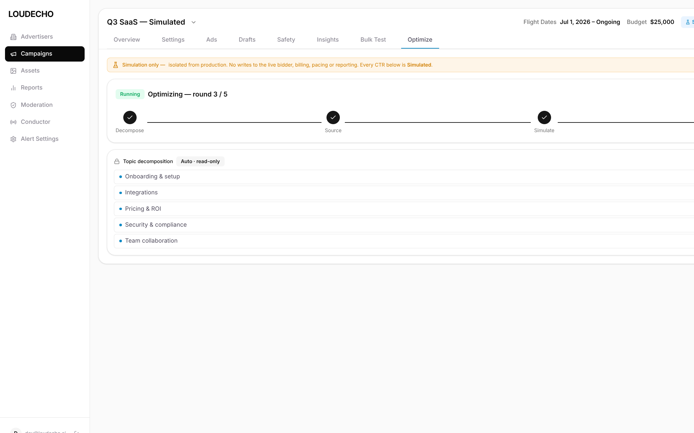
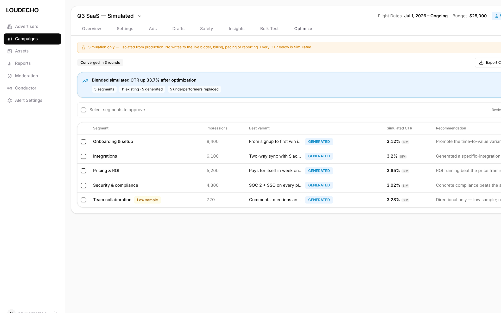
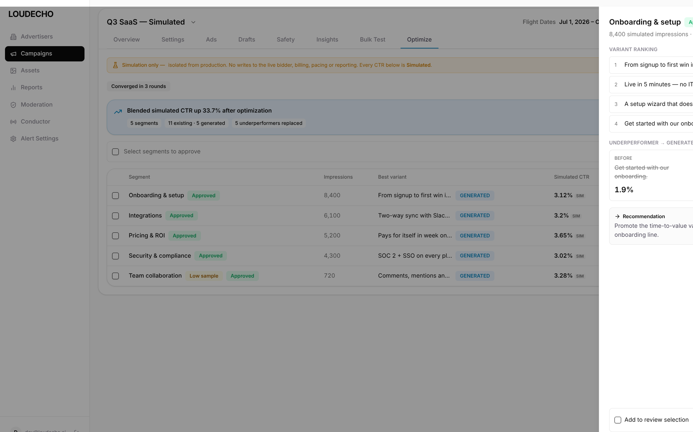

# ENG-1409 · Creative Optimization Simulation — `ENG1409-Claude`

> **Build variant** of the grill-before-build workflow: an agent-built **runnable interactive prototype slice** (Claude Code mini-app), not a planning-only critique. Companion to the planning-only `ENG1409-Control` / `ENG1409-Paper` branches.
>
> **Repo of record:** `dara-front` — a new **Optimize** tab on the campaign detail surface.

---

## 1. Executive summary

Operators want to know **which creative angle wins for each slice of an audience** before committing spend — and to let the system **auto-iterate the weak segments** until results stop improving. This is a **simulation**: it never touches the live bidder, billing, pacing, or reporting.

This slice implements the full loop as an interactive prototype:

**Configure a run (topic → segments) → staged pipeline (Decompose → Source → Simulate → Optimize, round-by-round, converge-or-cap) → results (pinned insights + per-segment table) → drill into a segment (before/after CTR, variant ranking) → bulk-approve winners into a review queue.**

Every screen lives inside the real `dara-front` campaign shell (sidebar, campaign header, underline `TabMenu`) with an ever-present **amber isolation banner** and `SIM` labels on every number, so it can never be mistaken for live data.

| | |
|---|---|
| **Feature** | Creative Optimization Simulation |
| **Slice** | Configure · Staged run loop · Results · Segment Sheet · Bulk approve |
| **UI shell** | `dara-front` campaign detail + `Optimize` tab |
| **Backend seam** | Simulation engine, stubbed in `prototype/src/features/optimize/engine.ts` |
| **Safety** | Simulation-only; isolation banner + `SIM` labels throughout |
| **Runnable** | `cd prototype && npm i && npm run dev` |

---

## 2. The loop, with evidence

### 2.1 Configure

Decompose a **topic** into segments, pick audience / geography / vertical / device, choose **simulation volume** (`Direct` impressions or `Budget + CPM`), set **convergence sensitivity** (`Low / Medium / High`) and a **max-rounds hard cap**. The `Run optimization` action shows how many eligible ads match the targeting. Sits under the campaign header + underline tab strip, below the amber isolation banner.



### 2.2 Staged run loop

`Run optimization` launches the pipeline: a horizontal stepper (`Decompose → Source → Simulate → Optimize`) and a live `Optimizing — round N / M` counter. The topic decomposition renders as a **read-only** subtopic tree (`Auto · read-only`). The loop **iterates weak segments and stops on convergence or the round cap** — whichever comes first.


### 2.3 Results

On completion: a `Converged in N rounds` badge, a **pinned insight** summary (`Blended simulated CTR up 33.7% after optimization`, `5 segments · 11 existing · 5 generated · 5 underperformers replaced`), and a **segment performance table** — impressions, best variant (`GENERATED` tag), simulated CTR (`SIM`), and a recommendation. Low-volume segments carry a `Low sample` warning. `Export CSV / JSON` and `Save snapshot` available.



### 2.4 Segment Sheet + bulk approve

Clicking a segment opens a right-anchored **Sheet**: variant ranking, `UNDERPERFORMER → GENERATED` before/after CTR compare, and a recommendation. The bulk toolbar selects segments and **approves winners into a review queue** (rows flip to `Approved`).



---

## 3. How to run

```bash
cd prototype
npm install
npm run dev          # http://localhost:5175  (any port is fine)
```

- Land on the campaign shell → **Optimize** tab (Configure state).
- `Run optimization` → watch the staged loop (round counter + stepper).
- On completion → segment table + pinned insights.
- Click a segment row → **Sheet**. Select rows → **Approve selected**.

No env vars, no auth, no backend required — the simulation engine runs client-side.

---

## 4. Workflow fidelity (steps 3–6)

| Step | Prompt requirement | This branch |
|------|--------------------|-------------|
| 3 · Prototype slice | Runnable slice using dara-front design language; scope in/out documented | `prototype/` + [`prototype/README.md`](prototype/README.md) |
| 4 · PRD merge notes | How devs pull this into dara-front | [`prd-resume.md`](prd-resume.md) |
| 5 · Build notes | Implementation loop, file map | [`case-study/04-build-notes.md`](case-study/04-build-notes.md) |
| 6 · Design review | Fidelity checklist + token compliance + ratings | [`case-study/05-design-review.md`](case-study/05-design-review.md) |

---

## 5. Local auth bypass (how these screens were captured)

`dara-front` gates every route behind Firebase auth (`withAuth` HOC). To run and screenshot the real campaign shell locally, an **env-gated dev bypass** was added — strictly non-production. See [`AUTH-BYPASS.md`](AUTH-BYPASS.md).

---

## 6. Ratings (1–5)

| Dimension | Score | Note |
|-----------|:-----:|------|
| Workflow fidelity (steps 3–6) | 5 | Runnable slice + merge notes + build notes + design review |
| UI / design-system fidelity | 5 | Real dara-front campaign shell, tokens, underline tabs, Sheet |
| Interaction completeness | 5 | Configure → converge-or-cap loop → results → Sheet → bulk approve |
| Simulation safety framing | 5 | Isolation banner + `SIM` labels on every number |
| Backend realism | 4 | Deterministic staged engine w/ convergence; stubbed, not wired |
| Production-readiness | 3 | Prototype/showcase — integration is a separate dev pass |
