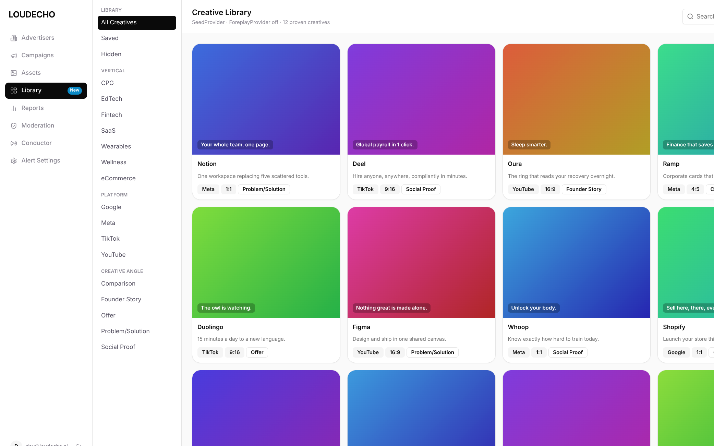
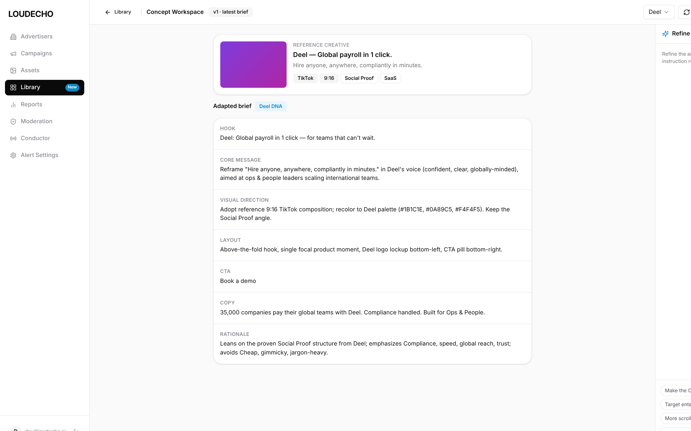

# ENG-1410 · Ad Creative Library & Concept Generation — `ENG1410-Claude`

> **Build variant** of the grill-before-build workflow: an agent-built **runnable interactive prototype slice** (Claude Code mini-app), not a planning-only critique. Companion to the planning-only `ENG1410-Control` branch.
>
> **Repo of record:** `echo-studio` (backend: concept adaptation, variant generation, creative providers) surfaced inside the **`dara-front`** operator shell (UI/IA/tokens).

---

## 1. Executive summary

Operators need to turn **proven ad creatives** (competitor / winning references) into **on-brand concepts** for their own advertisers, then fan those concepts out into **platform-ready variants** — without leaving the dashboard or hand-writing briefs.

This slice implements the full loop as an interactive prototype:

**Library gallery → open a reference → auto-adapt into a brief → refine in plain language (surgical edits) → generate variants → review streamed results.**

Every screen lives inside the real `dara-front` shell (LOUDECHO sidebar, `Library` nav item, tokens) so it reads as a native product surface, and the AI/backend calls are stubbed behind a typed `api.ts` seam that mirrors `echo-studio` contracts — swap the stubs for real executors at integration time.

| | |
|---|---|
| **Feature** | Ad Creative Library + Concept Generation |
| **Slice** | Gallery · Concept Workspace (adapt + refine) · Variant Review |
| **UI shell** | `dara-front` (sidebar IA, tokens, shadcn primitives) |
| **Backend seam** | `echo-studio` contracts, stubbed in `prototype/src/features/library/api.ts` |
| **Runnable** | `cd prototype && npm i && npm run dev` |

---

## 2. The loop, with evidence

### 2.1 Creative Library (gallery + facets)

Proven creatives land in a 4-up gallery. The facet rail (`Vertical · Platform · Creative angle`) and search narrow the set; each card carries brand, one-line summary, and `platform / format / angle` badges. The header shows the active provider (`SeedProvider · ForeplayProvider off · 12 proven creatives`) so it's obvious where inventory comes from.



### 2.2 Concept Workspace — adapt + refine loop

Opening a creative auto-runs **adaptation**: the reference is mapped into a structured **brief** with seven sections (Hook, Core message, Visual direction, Layout, CTA, Copy, Rationale), tagged with the target brand's DNA (`Deel DNA`). The right **chat rail** drives refinement — quick-action chips (`Make the CTA punchier`, `Bolder hook`, `Target enterprise`, …) or free text each run a **surgical edit** on one brief section, not a full regeneration. Every turn bumps the brief version (`v1 · latest brief`).



### 2.3 Variant Review — streamed generation with lineage

`Generate Variants` hands off to the review surface, where variants stream in (`Ready` badges appear as each lands) and every variant keeps a lineage chip back to its parent brief (`parent · cr-02`). This is the fan-out step operators queue for approval.


---

## 3. How to run

```bash
cd prototype
npm install
npm run dev          # http://localhost:5173
```

- **Gallery** loads immediately from the seed provider.
- Click any creative → **Concept Workspace** (auto-adapts).
- Click a quick-action chip or type an instruction → **surgical refine**.
- Click **Generate Variants** → **Review** (streamed).

No env vars, no auth, no backend required — the `echo-studio` seam is stubbed.

---

## 4. Workflow fidelity (steps 3–6)

| Step | Prompt requirement | This branch |
|------|--------------------|-------------|
| 3 · Prototype slice | Runnable slice using dara-front design language; scope in/out documented | `prototype/` + [`prototype/README.md`](prototype/README.md) |
| 4 · PRD merge notes | How devs pull this into dara-front | [`prd-resume.md`](prd-resume.md) |
| 5 · Build notes | Implementation loop, file map | [`case-study/04-build-notes.md`](case-study/04-build-notes.md) |
| 6 · Design review | Fidelity checklist + token compliance + ratings | [`case-study/05-design-review.md`](case-study/05-design-review.md) |

---

## 5. Local auth bypass (how these screens were captured)

`dara-front` gates every route behind Firebase auth (`withAuth` HOC). To run and screenshot it locally, an **env-gated dev bypass** was added — strictly non-production. See [`AUTH-BYPASS.md`](AUTH-BYPASS.md) for the exact change and how to enable it.

---

## 6. Ratings (1–5)

| Dimension | Score | Note |
|-----------|:-----:|------|
| Workflow fidelity (steps 3–6) | 5 | Runnable slice + merge notes + build notes + design review |
| UI / design-system fidelity | 5 | Real dara-front shell, tokens, shadcn primitives |
| Interaction completeness | 5 | Full loop clickable incl. surgical-edit refine + streamed variants |
| Backend realism | 4 | Typed `echo-studio`-shaped seam; stubbed, not wired |
| Production-readiness | 3 | Prototype/showcase — integration is a separate dev pass |
