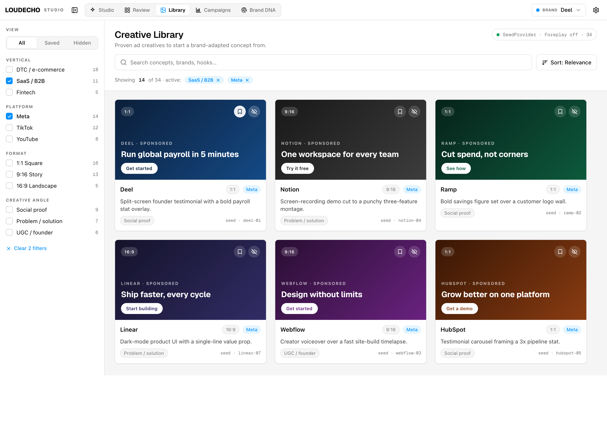
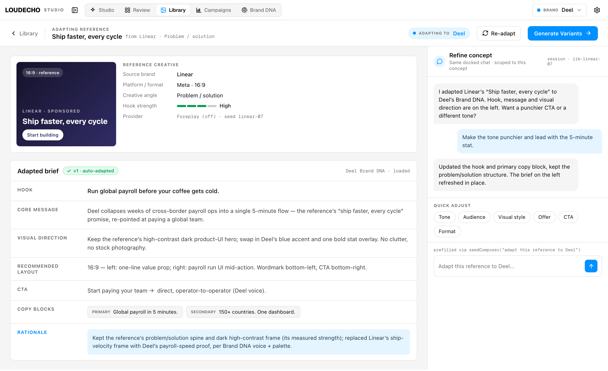
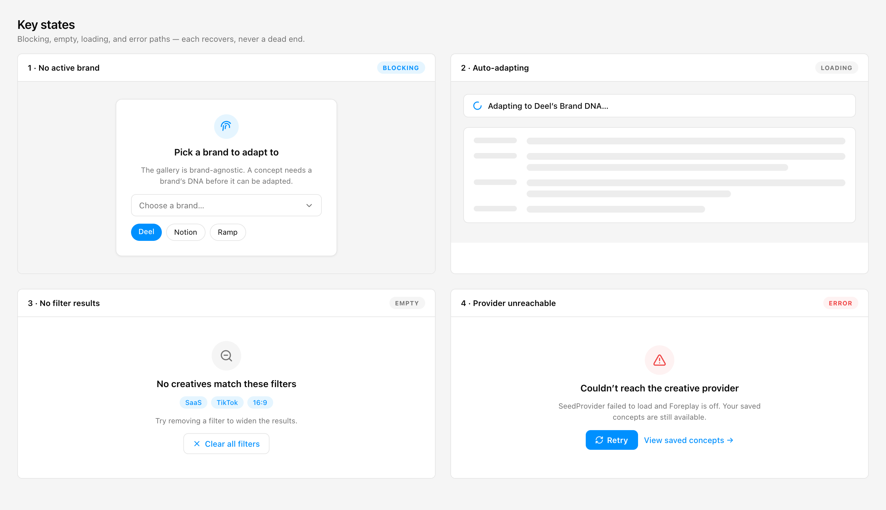

# Case Study · ENG-1410 — Ad Creative Library & Concept Generation (Paper arm)

| Field | Value |
|-------|-------|
| **Linear ticket** | [ENG-1410](https://linear.app/teza/issue/ENG-1410) — Ad Creative Library & Concept Generation |
| **Target repo** | echo-studio (Creative Intelligence Engine) |
| **Source branch** | `gavri/ENG-1410-creative-library-paper` |
| **Experiment branch** | `ENG1410-Paper` |
| **Workflow** | Grill-before-build — **Paper arm** |
| **Mock tool** | **Paper** (real vector mockups in the echo-studio V2 palette) |
| **Date** | 2026-07-01 |
| **Status** | **PLANNING** — grill → flows → mock → PRD complete; build not started |

---

## Executive summary

We ran grill-before-build against ENG-1410 to test whether an agent can turn a large, multi-surface ticket into a build-ready PRD **before** any code — and, in this arm, whether it can produce **product-faithful mockups in Paper** instead of a grayscale HTML fallback. The session locked nine decisions (D1–D9), two Mermaid flows, three Paper screens in the real echo-studio palette, and a ten-criterion PRD resume — all traceable to one grill log.

The strongest move: reading echo-studio first and **locking the "Library + glue" reframe up front** (D2, before any scope sprawl), keeping net-new scope tiny from question one. Honest gaps: the workspace mock docks the chat rail **right** while the real `AppShell` docks it **left** (a deferred build decision), fixtures/brief copy are illustrative, and the ticket's **version-history requirement is deliberately deferred** (D7). **Verdict:** genuine clarity, build-ready with those deferrals surfaced — **A− / strong**.

---

## The bet we were testing

ENG-1410 asks for an **Ad Creative Library**: ingest proven ads, browse them, adapt a selected concept to a brand's DNA, refine in chat, hand to variant generation — four features in one ticket. The experiment tested whether grill-before-build could **decompose** the ticket without losing the end-to-end story, **ground** decisions in what echo-studio already has (`direction_generator_executor`, `ChatRail`/`ChatPane`, `surgical_edit`, `BrandSwitcher`/`activeBrand`), **produce wireframes** that *extend* echo-studio's IA in the real palette, and **write a PRD** whose ACs map 1:1 to locked decisions. We did **not** test whether a Creative Library is a good business bet — only whether the workflow produces artifacts a senior PM/PD would trust before green-lighting build.

---

## Session narrative — the pivotal moments

The grill log ([`artifacts/grill-log.md`](artifacts/grill-log.md)) records one question at a time with a recommended answer. Three exchanges reframed the build.

**Moment 1 — Sharpen the user first (Q1 → D1).** The agent opened with *who*, not scope: the in-house performance marketer / growth lead at a DTC/SaaS advertiser **already on LoudEcho** (Brand DNA set), hunting inspiration manually today. Out: agencies, freelancers, internal curators. This made "adapt to the *active* brand" (D5) safe downstream.

**Moment 2 — "Library + glue," locked up front (Q2 → D2).** The defining discipline of this arm. After reading echo-studio, the agent reframed net-new as **ingest + gallery + curation + wiring**, reusing concept generation, `ChatRail`, Brand DNA, and the variant pipeline. Operator: yes. This collapsed net-new scope to three things — a provider adapter + normalized model, the gallery UI, and the glue turning a selection into an adapted concept + variant run. Every later decision falls out of it. Locking this *before* scope sprawl (vs un-sprawling later) is the cleaner MVP grill.

**Moment 3 — Honest deferral (Q7 → D7).** The ticket explicitly asks to "maintain version history … compare and revert." The agent neither dropped it silently nor over-built: keep **only the latest brief**, mutate in place, flag the cut with ⚠️ in both the grill log and PRD non-goals, and define a re-grill trigger if a stakeholder insists it ships. Traceable, honest, reversible.

**Fast path (D3–D9):**

| ID | Decision | Reuse / net-new |
|----|----------|-----------------|
| D3 | `CreativeProvider` adapter; **SeedProvider** fixtures (~34) drive demo; `ForeplayProvider` coded but **off** | Net-new adapter + fixtures |
| D4 | **Library** nav → `/library`; card → **Concept Workspace** `/library/[id]`; reuse `ChatRail` via `seedComposer()`; brief + **Generate Variants** CTA | Net-new surfaces + glue |
| D5 | Adapt to **global active brand**; no brand → inline blocking picker; gallery brand-agnostic | Reuse `activeBrand` |
| D6 | **Auto-adapt once** on open (skeleton) + explicit **Re-adapt** | Net-new trigger |
| D8 | Curation = **Save + Hide** only | Net-new (small) |
| D9 | Generate Variants → campaign/session → render → enqueue `surgical_edit` → `/review`; lineage via `parent_concept_id` | Reuse pipeline + `/review` |

**North-star:** selection→variant funnel — % who select a concept, adapt it, and click Generate Variants. **Secondary:** time from inspiration to first generated concept.

---

## Flow walkthrough

Two journeys in [`artifacts/flows.md`](artifacts/flows.md).

**Happy path:** open **Library** → gallery from SeedProvider → search + URL-param facet filter → click card → `/library/[id]` → (if no brand, inline picker) → **auto-adapt once** behind a skeleton → refine the `v1` brief in the reused chat rail → **Generate Variants** → render + enqueue `surgical_edit` → navigate to **`/review`**.

**Recovery branches (never a dead end):**

| State | Trigger | Recovery |
|-------|---------|----------|
| Empty gallery | No fixtures / all hidden | Onboarding hint |
| Provider fetch error | SeedProvider load fails | **Retry** + "View saved concepts →" |
| No filter results | Facet combo empty | **Clear filters** |
| No active brand | No `activeBrand` | Inline **brand picker** blocks workspace |
| Adaptation error | Executor fails | **Retry / Re-adapt** in brief pane |
| Variant enqueue failure | Enqueue fails | Toast; stay in workspace |

A curation sub-flow covers **Save** (badge + Saved segment) and **Hide** (undo via Hidden).

---

## Interaction design — the picks

Each step records 2–3 options + a pick grounded in real component/route names:

- **Gallery browse →** shadcn `Card` grid. Reuses `Card`/`Badge` + `/review` tile density; autoplay masonry is perf risk for a fixture MVP.
- **Search + filter →** facet sidebar + keyword search, **filters in URL params**. Mirrors `/review?view=`; deep-linkable, shareable, back-button safe.
- **Workspace layout →** two-pane (reference + brief left, `ChatRail` right). Keeps the source ad visible while refining; tabs would hide it. *(Rail-side delta below.)*
- **Refinement →** reuse the docked `ChatRail` via `seedComposer` **+ quick-action chips**. Leverages the production SSE `ChatPane`; chips add discoverability without losing free-form power.
- **Generate Variants →** header CTA → enqueue → toast + auto-navigate to `/review`. Zero net-new variant UI (D9); preserves session/brand context.

---

## Wireframe review — Paper screens & fidelity

**Paper** authored **real vector mockups** with the echo-studio V2 tokens ported in: neutral surfaces + `--accent` brand-blue `#0090FF`, `--success` `#0A9C55`, Geist / Geist Mono. This is the arm's whole point — the screens read as the actual product, not a grayscale proxy. Details: [`artifacts/mockup-notes.md`](artifacts/mockup-notes.md).

### Screen 1 — Creative Library gallery

Real TopBar (pill nav **Studio · Review · Library · Campaigns · Brand DNA**, Library active; `BrandSwitcher` "Brand · Deel"), left facet sidebar (All/Saved/Hidden + Vertical/Platform/Format/Creative angle with counts), provenance pill **"SeedProvider · Foreplay off · 34"**, search + Sort, "Showing 14 of 34", 3-up card grid with hover Save/Hide.

**Proves:** D3, D4, D5, D8, picks §1–§2. **Fidelity:** nav + active-pill = *Extension*; `BrandSwitcher` = *Match*; card grid = *Extension*; facets + Save/Hide = *Gap (net-new)*; **design tokens = Match** (real V2 tokens — the differentiator vs Control's grayscale).

### Screen 2 — Concept Workspace (`/library/[id]`)

Cloned TopBar + sub-header (← Library, **ADAPTING TO Deel** pill, **Re-adapt**, **Generate Variants →**). Left: reference card (source metadata, provider `Foreplay (off) · seed linear-07`) above the **Adapted brief** with a green `v1 · auto-adapted` tag and labeled sections (Hook, Core message, Visual direction, Recommended layout, CTA, Copy chips, Rationale). Right: the reused chat rail with **Quick adjust** chips and the `seedComposer("adapt this reference to Deel")` prefill. **No version rail** (D7).

**Proves:** D2/D4, D5, D6, D9, picks §3–§5. **Fidelity:** `seedComposer` = *Match*; brief sections + chips = *Extension*; Re-adapt / Generate Variants = *Gap (net-new glue)*; → `/review` = *Match*; version rail = *intentionally omitted*. **⚠️ Delta:** mock docks chat **right** (reference-visible) vs real `AppShell` **left** — both buildable, resolve in PRD.

### Screen 3 — Key states

2×2: **① No active brand (BLOCKING)** picker; **② Auto-adapting (LOADING)** skeleton; **③ No filter results (EMPTY)** + Clear all filters; **④ Provider unreachable (ERROR)** + Retry / View saved. Every recovery branch present; destructive/success/accent tokens = *Match*.

**Layout-gate verdict: PASS** — real palette, extends real IA, every D1–D9 visible or intentionally represented (D7 = lone "v1" tag), no dead ends. One decision to resolve with the PRD: the chat-rail dock side.

---

## PRD resume — key sections

From [`artifacts/prd-resume.md`](artifacts/prd-resume.md):

- **What:** Creative Library → select proven ad → adapt to active brand's DNA → refine in existing chat → **Generate Variants** into the existing `/review` workflow. Net-new = Library + glue.
- **Why:** concept ideation is manual and disconnected from variant generation; this makes proven ads a first-class, brand-adaptable input to the engine echo-studio already has.
- **Acceptance criteria (10):** Library nav/gallery (SeedProvider); ~34 fixtures + Foreplay off; cards + Save/Hide; URL-param facets; two-pane Concept Workspace; active-brand adaptation + inline blocking picker; auto-adapt-once + Re-adapt; chat refines latest brief in place (no version rail); Generate Variants → `surgical_edit` → `/review` (`parent_concept_id`); all recovery states.
- **Out of scope:** live Foreplay on demo path; **version history/compare/revert (deferred ticket req)**; free-form tagging/curated galleries; multi-brand fan-out; net-new variant UI; any dara-backend/adtech contract change.
- **Open questions:** seed fixture count (~34, rec yes); chat-rail dock side (rec right). Both non-blocking.

---

## What the agent got right — and wrong

**Right:** codebase-first grilling prevented rebuilding existing systems; the **reframe was locked up front** (not after grilling all four); every AC cites D1–D9; deferrals (D7/D8) are logged with re-grill triggers; **Paper mockups use real V2 tokens** so the layout gate judged the actual product; every error/empty/blocking branch recovers.

**Wrong / weak:** the **rail-side delta** (right in mock vs left in `AppShell`) leaves a build decision open; fixtures and brief copy are illustrative (build must wire real assets + adaptation output); key states are static panels; planning-only — no shipped UI to verify wireframe→build fidelity.

---

## Critique verdict

**Grade: A− / strong.**

The up-front reframe eliminated the Control arm's biggest weakness (scope inflation from grilling "all four"); Paper mockups are product-faithful so the layout gate is meaningful; ACs are testable and mapped to decisions; recovery states are complete; the deferred ticket requirement is explicit and reversible. Not a 5 because the rail-side delta and illustrative fixtures leave real build decisions open, and it's planning-phase only.

**Would I approve and start build?** **Yes** — resolve the two non-blocking open questions (fixtures ~34; rail → right), build the gallery first, then wire the glue.

### Ratings

| Dimension | Score (1–5) | Evidence |
|-----------|:-----------:|----------|
| Clarity added before build | **5** | D2 reframe locked up front + 9 decisions; open questions explicit, non-blocking |
| Grounding in design stack / IA / app logic | **4** | Real V2 tokens + named reuse (`ChatRail`, `BrandSwitcher`, `/review`, `seedComposer`); rail-side delta open |
| UX best practices / approach quality | **5** | 2–3 options + pick on 5 interactions; full recovery states; Save/Hide sub-flow |
| Build readiness | **4** | Buildable, small scope; fixtures + rail side to finalize at build |
| Overall workflow grade | **4.5** | Disciplined up-front reframe + product-faithful Paper mocks; rail delta + planning-only cap below 5 |

---

## Paper arm vs Control

1. **Product-faithful mockups.** Paper screens use the **real echo-studio V2 palette** (`#0090FF`, Geist, neutral surfaces); Control fell back to **grayscale HTML → Chromium** (Pencil unavailable) — layout-valid but not design-system-faithful.
2. **Reframe locked up front.** This arm locked **"Library + glue" (D2) before scope sprawl**; Control locked "grill all four" first and reframed after, inflating PRD bulk. The Paper arm is the more disciplined MVP grill.
3. **Same honest gaps.** Both defer version history and use illustrative fixtures; the Paper arm additionally surfaces the **rail-side delta** as a deferred build decision.

---

## Appendix — artifact index

| Artifact | Path | Purpose |
|----------|------|---------|
| Grill log | [`artifacts/grill-log.md`](artifacts/grill-log.md) | D1–D9 Q&A + locked decisions + re-grill triggers |
| Flows & interactions | [`artifacts/flows.md`](artifacts/flows.md) | Mermaid journeys + interaction matrices |
| Mockup notes | [`artifacts/mockup-notes.md`](artifacts/mockup-notes.md) | Paper wireframe validation + layout-gate verdict |
| PRD resume | [`artifacts/prd-resume.md`](artifacts/prd-resume.md) | Shape Up summary + 10 ACs |
| Screenshots | [`artifacts/screenshots/`](artifacts/screenshots/) | 01-gallery, 02-concept-workspace, 03-key-states |
| Full PRD | echo-studio monorepo: `docs/tasks/gavri/ENG-1410-creative-library-paper/prd.md` | Not duplicated on this branch |

---

*This case study critiques **agent output quality**, not whether a Creative Library is the right product bet. Planning-phase audit only — no implementation on this branch.*
