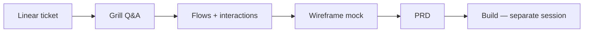

# prd-tests

**Product research workflow experiments** — each branch is one agent run of the **grill-before-build** pipeline. The branch README is a **senior PM/PD case study with evidence**, not the PRD itself and not a bullet dump.

This repo tests whether an agent workflow (grill → flows → mock → PRD) produces build-ready product artifacts **before any code is written**. We evaluate **output quality and workflow fidelity**, not whether the underlying product ideas are good business.

---

## Setup & installation

Use this section to reproduce the workflow on a **new machine** (Cursor, Claude Code, or both). Everything you need to copy-paste lives in this repo or links below.

### 1. Clone repos

```bash
# Product research experiments (this repo)
git clone https://github.com/gavrizz/prd-tests.git
cd prd-tests

# LoudEcho monorepo (skills, brain, target apps) — required for real runs
git clone git@github.com:sepana-io/loudecho.git   # or your fork/path
cd loudecho
# Ensure sub-repos exist: loudecho-brain, dara-front, echo-studio, etc.
```

| Repo | Why you need it |
|------|-----------------|
| **prd-tests** | Case study critiques per branch; agent prompt copy |
| **loudecho** workspace | Skills, VP rules, target codebases, task artifacts |
| **loudecho-brain** | Source of truth for skills (`grill-me-product`, design stack) |

### 2. Cursor — skills & rules

Skills are **not** in prd-tests. They live in the LoudEcho workspace.

```bash
cd loudecho

# Workspace skills (symlink or copy from brain)
# Typical layout:
#   .cursor/skills/grill-me-product/
#   .cursor/skills/build-screen/
#   .cursor/skills/loudecho-brand/
#   .cursor/skills/loudecho-component-library/
#   .cursor/skills/impeccable/
#   .cursor/skills/frontend-design/
#   .cursor/skills/agentic-discipline/
```

**Brain paths (canonical):**

| Skill | Path |
|-------|------|
| Grill | `loudecho-brain/.agent/skills/grill-me-product/SKILL.md` |
| Design stack | `build-screen` → `loudecho-brand` → `loudecho-component-library` → `impeccable` → `frontend-design` |
| Safety | `loudecho-brain/.agent/skills/agentic-discipline/SKILL.md` |
| PRD format | `loudecho-brain/.agent/skills/session-workflow/SKILL.md` |

Cursor reads workspace rules from `loudecho/.cursor/rules/` and `AGENTS.md`. Open the **loudecho** folder as the Cursor workspace root (not prd-tests alone).

### 3. Cursor — MCP servers

Copy or merge `loudecho/.cursor/mcp.json`:

| Server | Purpose | Setup |
|--------|---------|--------|
| **Linear** | Fetch tickets | Cursor plugin or user MCP — authenticate once per machine |
| **Paper** | Product-faithful mocks | Install [Paper Desktop](https://paper.design); open a file; MCP at `http://127.0.0.1:29979/mcp` |
| **Pencil** | Optional vector mocks | Install Pencil.app; stdio MCP in `mcp.json` |
| **GitHub** | Push branches, PRs | Authenticate via plugin |

Reload Cursor after MCP changes: **Cmd+Shift+P → Developer: Reload Window**.

### 4. Storybook (dara-front component reference)

Mocks should match **real components**, not generic gray boxes. dara-front Storybook is the visual catalog.

```bash
cd loudecho/dara-front
npm install
npm run storybook    # http://localhost:6006
```

**Before mocking dara-front UI**, the agent must read:

| Reference | Path / Storybook |
|-----------|------------------|
| Component routing table | `loudecho-brain/.agent/skills/loudecho-component-library/components.md` |
| Campaign tabs | `src/components/LineTabs.tsx` — Storybook: `Custom Components/Layout/LineTabs` |
| Simulation inputs | `src/components/SimulationMode/InputsPanel.tsx` |
| Simulation card | `src/components/SimulationMode/SimulationModeCard.tsx` |
| Amber isolation banner | `src/components/Overview.js` (simulated-data banner) |
| Design tokens | `loudecho-brain/.agent/skills/loudecho-brand/DESIGN.md` |

**echo-studio:** read `studio/app/globals.css`, `studio/components/shell/TopBar.tsx`, existing routes (`/review`, `/campaigns`, `/brand`).

### 5. Paper mocks — same design VP as build

Paper is **not** a freeform wireframe tool in this workflow. It follows the **same design ops as implementation**:

1. Load full design skill stack (`build-screen` → … → `frontend-design`)
2. Read target repo UX + `components.md` + Storybook paths above
3. Use **real token values** (colors, type, spacing) from `loudecho-brand/DESIGN.md` or repo `globals.css`
4. Name **real components** in mockup notes (`LineTabs`, `Select`, `Sheet`, `SimulationModeCard`, etc.)
5. Screenshot via Paper MCP → `case-study/screenshots/`
6. Document fidelity checklist in `03-mockup-notes.md` (match / extension / gap per element)

**Low-fi gray HTML wireframes are not sufficient** for PRD approval on dara-front / echo-studio UI features.

Paper plugin: install `paper-desktop` Cursor plugin if not present. Ensure Paper Desktop is running with a file open before the agent calls Paper MCP.

### 6. Launch a case study (Cursor) — copy/paste

1. Open **loudecho** workspace in Cursor (fresh agent chat).
2. Open [`prompts/grill-before-build-agent-prompt.md`](prompts/grill-before-build-agent-prompt.md).
3. Copy the **fenced prompt block** (between the triple backticks).
4. Change one line: `TICKET: ENG-____` (e.g. `ENG-1410` or `ENG-1409`).
5. Paste into a **new agent** and send.

**Minimal Slack message to yourself/teammate:**

```
Run grill-before-build:
1. Clone loudecho + prd-tests
2. Open loudecho in Cursor, new agent
3. Paste prompt from https://github.com/gavrizz/prd-tests/blob/main/prompts/grill-before-build-agent-prompt.md
4. Set TICKET: ENG-XXXX
5. Paper Desktop open; Storybook optional at :6006 for dara-front
```

**After the run publishes a critique:**

```bash
cd prd-tests
git checkout -b ENGxxxx-YourVariant
# Copy artifacts + write README case study (see ENG1410-Control for format)
git push -u origin ENGxxxx-YourVariant
```

### 7. Claude Code + Claude Design (alternative path)

Anthropic’s **Claude Design** (beta) is a separate surface for on-brand visual work, synced with **Claude Code** for implementation. Useful if you prefer browser/desktop design canvas over Paper-in-Cursor.

#### Pull latest target repo first (required)

**Yes — pull latest `dara-front` (or `echo-studio` for studio tickets) before every Claude Code run.** A PRD or case study alone is not enough for LoudEcho-faithful mocks or build.

Claude learns UI from the workspace, not from memory. Without current code it will invent generic admin UI (what went wrong on Control runs).

```bash
cd loudecho
git pull

# dara-front tickets — merge target is staging
cd dara-front
git fetch origin
git checkout staging
git pull origin staging

# echo-studio tickets — merge target is main
# cd ../echo-studio && git fetch && git checkout main && git pull

cd ../loudecho-brain && git pull
```

| Phase | Need latest repo? | Why |
|-------|-------------------|-----|
| Grill + flows + PRD | **Yes** | Ground reuse vs net-new in real screens |
| Mocks / draft UI | **Yes** | Match tabs, forms, banners, component catalog |
| Build | **Yes** — feature branch off `staging` / `main` | Ship what matches the product today |

Open the **`loudecho`** workspace root in Claude Code (not `prd-tests` alone). Optional: `cd dara-front && npm run storybook` → `:6006` for visual reference.

| Step | Where | Action |
|------|--------|--------|
| **Prep** | Terminal | Pull `staging` / `main` on target repo + `loudecho-brain` (see above) |
| Design | [claude.ai/design](https://claude.ai/design) or Claude **desktop app sidebar** | Create mockups, decks, prototypes |
| Import design system | Claude Design settings | Connect **GitHub repo** (`dara-front` / `echo-studio`) so Claude uses your components & tokens |
| Sync from code | Claude Code terminal | `/design-sync` — pull design system from codebase into Claude Design |
| Start from code | Claude Code | `/design` — create/edit design projects from terminal |
| Handoff to build | Claude Design → Export | **Handoff to Claude Code** — bundle includes tokens, layout intent, component structure |
| Build | Claude Code in `dara-front` or `echo-studio` | “Build this handoff bundle using Next.js + our shadcn components” |

**LoudEcho-specific tips:**

- Import **dara-front** (or echo-studio) as the design-system source in Claude Design so mocks stay on-brand — use the **same branch** you pulled (`staging` / `main`).
- Point Claude at `loudecho-brain/.agent/skills/loudecho-brand/DESIGN.md` and `loudecho-component-library/components.md` in the handoff brief.
- Agent rule: **read real screens + Storybook paths from `components.md` before any mock** — PRD-only is insufficient.
- After Claude Code builds, push to GitHub → normal LoudEcho PR + design-reviewer gate still applies.

Claude Design shares usage limits with Claude Code (Pro/Max/Team). Enterprise may need admin enable.

### 8. Second machine checklist

- [ ] Clone `loudecho` + `prd-tests`
- [ ] **Pull latest `dara-front` `staging`** (or `echo-studio` `main`) + `loudecho-brain` before any Claude Code / mock / build run
- [ ] Cursor: same account (Settings Sync optional for user rules)
- [ ] Symlink/copy skills from `loudecho-brain` → `.cursor/skills/`
- [ ] Copy `loudecho/.cursor/mcp.json`; re-auth Linear + GitHub
- [ ] Install Paper Desktop + Pencil (optional)
- [ ] `dara-front`: `npm install` + `npm run storybook` when mocking dashboard UI
- [ ] Paste agent prompt from this repo; set `TICKET`
- [ ] Publish case study branch to `gavrizz/prd-tests` when done

### 9. Quick links

| Resource | URL |
|----------|-----|
| Agent prompt (copy source) | [`prompts/grill-before-build-agent-prompt.md`](prompts/grill-before-build-agent-prompt.md) |
| Control case study (1410) | [`ENG1410-Control`](tree/ENG1410-Control) |
| Control case study (1409) | [`ENG1409-Control`](tree/ENG1409-Control) |
| Paper arm example (1410) | [`ENG1410-Paper`](tree/ENG1410-Paper) |
| Monorepo control report | LoudEcho `docs/case-studies/grill-before-build-control-arm-report.md` |

---

## How to read a case study

Each branch README follows a narrative case-study structure. A lay product person should be able to read one branch top-to-bottom and understand **what was tested, what got locked, and whether they'd green-light build**.

| Section | What you'll find |
|---------|------------------|
| **Metadata table** | Linear ticket, repo, branch, date, status (PLANNING / BUILD / SHIPPED) |
| **Executive summary** | 3-sentence verdict |
| **The bet** | Which workflow hypothesis this run tests |
| **Session narrative** | Pivotal Q&A exchanges with quoted decisions and why they mattered |
| **Flow walkthrough** | Plain-English summary of Mermaid diagrams (full diagrams in `artifacts/flows.md`) |
| **Interaction design** | 2–3 options + pick pattern with IA/app-logic rationale |
| **Wireframe review** | Embedded screenshots with captions explaining what each proves |
| **PRD resume** | Key What/Why/AC sections inline (full PRD stays in LoudEcho monorepo) |
| **UX fidelity** *(dara-front runs)* | Honest comparison of wireframes vs real component patterns |
| **Right / wrong** | What the agent got right and weak spots |
| **Critique verdict** | Superb or subpar — **with evidence**, skeptical but fair |
| **Ratings table** | Scored dimensions (see rubric below) |
| **Appendix** | Artifact index |

**Important:** Case studies judge **agent output quality** (clarity, scope discipline, buildability, traceability, UX fidelity). They do not evaluate product-market fit.

---

## Rating rubric (1–5)

Scores appear at the end of every branch case study.

| Dimension | 1 — Poor | 3 — Adequate | 5 — Excellent |
|-----------|----------|--------------|---------------|
| **Clarity added before build** | Major ambiguities remain; builder would re-discover scope in code | Core happy path locked; some open questions | Decisions traceable; ACs map to grill log; open questions explicit and few |
| **Grounding in design skill stack / IA / app logic** | Wireframes invent foreign UI; ignores existing nav/tabs/components | Extends real IA; wireframes structural only | Reads target repo UX before mock; references real component names; wireframes use repo tokens/patterns |
| **UX best practices / approach quality** | No error states; no option matrices; pixel debate in grill | Flows + key interactions documented; layout gate passed | Edge-state table; 2–3 options + rationale per step; isolation/accessibility considered |
| **Build readiness** | PRD not buildable; hidden backend deps; contract changes smuggled in | Buildable with conditions; stub seams or scope chop noted | Clear ACs, additive-only contracts, stub/backend seam explicit, P1 chop if needed |
| **Overall workflow grade** | Re-grill required | Approve with conditions | Approve; workflow superb |

---

## Workflow under test



**Pipeline steps:**

1. **Grill** — structured Q&A locks product decisions (`grill-me-product` skill + MVP stop rules)
2. **Flows** — Mermaid diagrams + interaction option matrices (logic only, no pixel debate)
3. **Mock** — low-fi wireframes (Pencil or HTML fallback) → PNG screenshots; must extend existing repo IA
4. **PRD** — Shape Up structure with acceptance criteria traceable to grill decisions
5. **Build** — intentionally out of scope for control-arm branches (planning-phase audits)

Agent prompt: [`prompts/grill-before-build-agent-prompt.md`](prompts/grill-before-build-agent-prompt.md) (also in LoudEcho monorepo at `docs/case-studies/grill-before-build-agent-prompt.md`).

---

## Branch naming

```
{TICKET}-{Variant}
```

| Part | Meaning | Example |
|------|---------|---------|
| `TICKET` | Linear ID, no hyphen | `ENG1410`, `ENG1409` |
| `Variant` | Experiment arm | `Control` (standard prompt), `Skill-Test` (alternate skill stack) |

| Branch | Ticket | Variant | Status |
|--------|--------|---------|--------|
| [`ENG1410-Control`](tree/ENG1410-Control) | ENG-1410 Creative Library | Control (HTML wireframe) | PLANNING complete |
| [`ENG1410-Paper`](tree/ENG1410-Paper) | ENG-1410 Creative Library | Paper (design tokens) | PLANNING complete |
| [`ENG1409-Control`](tree/ENG1409-Control) | ENG-1409 Optimization Simulation | Control (HTML wireframe) | PLANNING complete |
| [`ENG1409-Pencil`](tree/ENG1409-Pencil) | ENG-1409 Optimization Simulation | Pencil arm | See branch |

---

## Branches at a glance

### ENG1410-Control · echo-studio

Ad Creative Library & Concept Generation. Nine locked decisions (D1–D9), reuse-heavy spec (Library + glue), three wireframe screens. **Verdict:** approve PRD with P1-first build chop. **Overall: 4/5.**

### ENG1409-Control · dara-front

Creative Optimization Simulation. Eight locked decisions + Q9 default, new Optimize tab on simulated campaigns, typed stub backend. **Verdict:** approve and build first. **Overall: 4/5.**

---

## Artifact layout (per branch)

```
ENGxxxx-Variant/
├── README.md              ← case study (start here)
└── artifacts/
    ├── grill-log.md
    ├── flows.md
    ├── mockup-notes.md
    ├── prd-resume.md
    └── screenshots/*.png
```

Full PRDs remain in LoudEcho monorepo task directories; branches carry summaries and evidence only.

---

## Related

- Control-arm summary report: LoudEcho monorepo `docs/case-studies/grill-before-build-control-arm-report.md`
- Agent prompt template: [`prompts/grill-before-build-agent-prompt.md`](prompts/grill-before-build-agent-prompt.md)

---

*Maintained as a portfolio-style experiment log. Planning-phase audits unless branch status says otherwise.*
