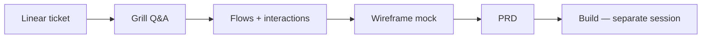

# prd-tests

**Product Research workflow experiments** — each branch is one agent run; the branch README is a **PM critique of agent outputs**, not the PRD itself.

This repo tests whether a **grill-before-build** agent workflow (grill → flows → mock → PRD) produces build-ready product artifacts before any code is written. We evaluate **output quality**, not the underlying product ideas.

---

## What this repo is

| Layer | What it contains |
|-------|------------------|
| **Main (`main`)** | Experiment framing, changelog, how to read case studies |
| **Each branch** | One workflow experiment + PM critique + copied artifacts |
| **Not here** | Implementation code, monorepo task dirs, secrets |

---

## Workflow under test



**Pipeline steps:**

1. **Grill** — structured Q&A locks product decisions before spec work (`grill-me-product` skill)
2. **Flows** — Mermaid diagrams + interaction option matrices
3. **Mock** — low-fi wireframes (Pencil or HTML fallback) → PNG screenshots
4. **PRD** — Shape Up structure with acceptance criteria traceable to grill decisions
5. **Build** — intentionally out of scope for these branches (planning-phase audits only)

The agent prompt concept lives in the LoudEcho workspace at `docs/case-studies/grill-before-build-agent-prompt.md` (private monorepo).

---

## How to read a case study

Each branch README is written as a **skeptical PM review** of what the agent produced:

1. **Executive verdict** — would you approve this PRD and start build?
2. **Workflow under test** — which variant of the pipeline ran
3. **Output inventory** — what artifacts exist on the branch
4. **Critique by artifact type** — grill log, flows, mocks, PRD
5. **Screenshots** — embedded wireframes with layout notes
6. **Gaps & risks** — deferrals, open questions, process friction
7. **Build readiness** — honest go/no-go with recommendations
8. **Lessons for next run** — what to change in the workflow prompt/skills

**Important:** Critiques judge **agent output quality** (clarity, scope discipline, buildability, traceability). They do not evaluate whether the product idea is good business.

---

## Branch naming

```
{TICKET}-{Variant}
```

| Branch | Ticket | Variant | Status |
|--------|--------|---------|--------|
| [`ENG1410-Control`](tree/ENG1410-Control) | ENG-1410 Creative Library | Control arm (standard grill-before-build) | Planning complete |
| [`ENG1409-Control`](tree/ENG1409-Control) | ENG-1409 Optimization Simulation | Control arm | Planning complete |
| [`ENG1410-Skill-Test`](tree/ENG1410-Skill-Test) | ENG-1410 | Reserved for skill-variant experiment | Placeholder |

---

## Branches at a glance

### ENG1410-Control

**Repo:** echo-studio · **Feature:** Ad Creative Library & Concept Generation

Agent run produced 9 locked grill decisions, Mermaid flows, 3 wireframe screens, and a 10-AC PRD. PM verdict: **approve with P1-first build chop** — reuse strategy is sound, but scope is large.

### ENG1409-Control

**Repo:** dara-front · **Feature:** Creative Optimization Simulation

Agent run produced 8 locked decisions + 1 default, state diagrams, 4 wireframe screens, and a 12-AC PRD with typed stub backend. PM verdict: **approve and build first** — smaller blast radius, stub seam well-defined.

### ENG1410-Skill-Test

Reserved for a future run testing an alternate skill stack or prompt variant against the ENG1410-Control baseline.

---

## Artifact layout (per branch)

```
ENGxxxx-Variant/
├── README.md              ← PM critique (start here)
└── artifacts/
    ├── grill-log.md
    ├── flows.md
    ├── mockup-notes.md
    ├── prd-resume.md
    └── screenshots/*.png
```

Full PRDs remain in the LoudEcho monorepo task directories; branches carry `prd-resume.md` summaries only.

---

## Related

- LoudEcho workspace case study report: `docs/case-studies/grill-before-build-control-arm-report.md` (monorepo, private)
- Agent prompt template: `docs/case-studies/grill-before-build-agent-prompt.md` (monorepo, private)

---

*Maintained as a portfolio-style experiment log. Planning-phase audits only — no implementation branches yet.*
