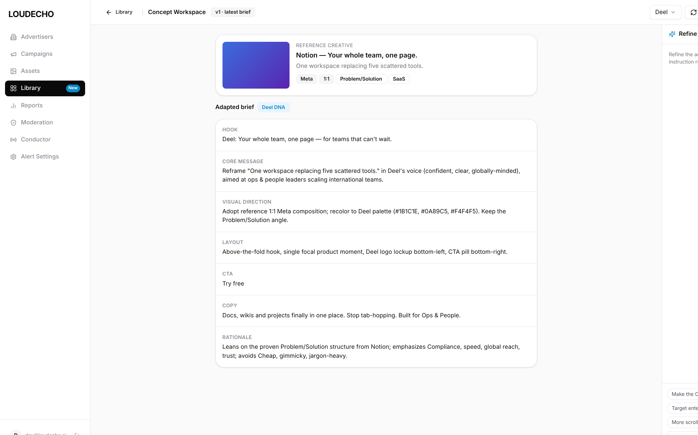
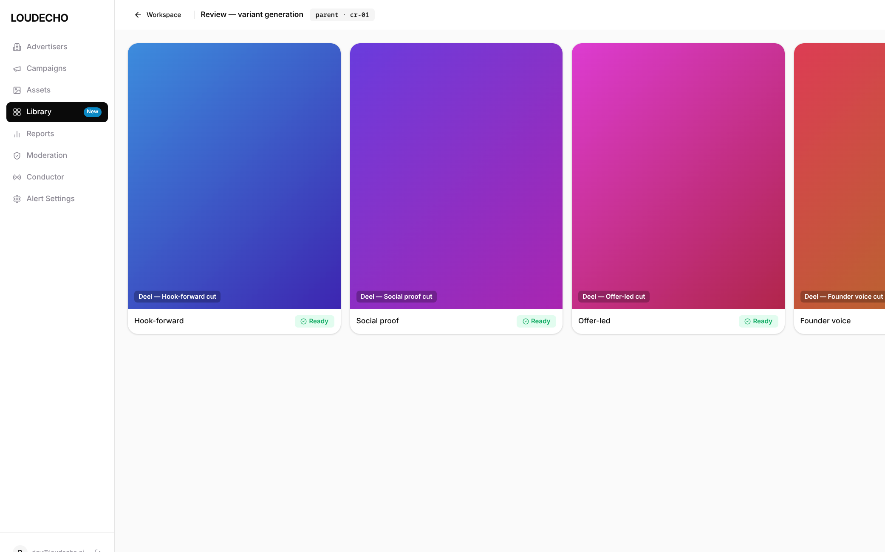

# Case Study · ENG-1410 — Ad Creative Library & Concept Generation (Build Arm)

| Field | Value |
|-------|-------|
| **Linear ticket** | [ENG-1410](https://linear.app/teza/issue/ENG-1410) — Ad Creative Library & Concept Generation |
| **Target repo** | echo-studio (backend: concept adaptation, variants, providers) surfaced in **dara-front** (UI/IA/tokens) |
| **Experiment branch** | `ENG1410-Claude` |
| **Companion branch** | `ENG1410-Control` (planning-only critique) / `ENG1410-Paper` |
| **Workflow** | Grill-before-build — **build arm** (runnable interactive prototype slice) |
| **Date** | 2026-07-04 |
| **Status** | **BUILD** — runnable `prototype/` slice + live in-browser screenshots + build notes + design review |

---

## Executive summary

Where `ENG1410-Control` stopped at a build-ready PRD, this branch runs the **build arm**: it turns the same ticket into a **runnable interactive prototype slice** that a developer can `npm run dev` and click through end to end. The slice implements the full loop — **Library gallery → open a proven creative → auto-adapt into a brand-DNA brief → refine in plain language (surgical per-section edits) → Generate Variants → streamed review with lineage** — inside the real **dara-front** shell, using dara-front tokens and shadcn primitives, with the AI/backend calls stubbed behind a typed `echo-studio`-shaped seam. The agent's strongest move was reproducing the shell from **live screenshots of the real app** (captured via a dev auth bypass) rather than approximating it, so fidelity is design-system-true, not grayscale. The weakest point is that the backend is stubbed — realism ends at the `api.ts` boundary. **Verdict:** the build arm delivers exactly what the Control arm's wireframes could only promise — a clickable, token-faithful slice with real interaction loops — and is ready to hand to a dev for dara-front/echo-studio integration.

---

## The bet we were testing

The Control arm tested whether grilling produces a trustworthy PRD **before** code. The build arm tests a different claim:

1. **Can an agent build a runnable slice** — not a static mock — that reproduces dara-front's design language faithfully?
2. **Can it model the real interaction loops** (auto-adapt, surgical refine, streamed variant generation) behind a swappable backend seam?
3. **Can it extend dara-front's IA** (a new `Library` surface) so the slice reads as a native product screen?
4. **Can it prove the loop works** with live browser evidence, not just claims?

We did **not** test whether a Creative Library is good business — only whether the build-arm workflow yields an interactive artifact a senior PM/PD would trust as a spec + showcase.

---

## Session narrative — pivotal build moments

### Moment 1 — Live shell as source of truth

No dara-front Figma file key was available. Rather than approximate the chrome, the agent ran dara-front locally behind an **env-gated dev auth bypass** (see [`AUTH-BYPASS.md`](AUTH-BYPASS.md)) and captured the real shell (`case-study/screenshots/_ref-dara-front-shell.png`). The prototype's `Sidebar`, tokens, and spacing were then reproduced from that reference — this is what makes the gallery below read as a real dara-front screen, not a lookalike.

### Moment 2 — Typed backend seam, not fake buttons

The riskiest way to fake this feature would be hardcoded screens. Instead the agent isolated all AI/backend behavior into `prototype/src/features/library/api.ts` (`fetchCreatives`, `adaptConcept`, `refineConcept`, `generateVariants`), each async with realistic latency and echo-studio-shaped outputs. The UI and hooks are transport-agnostic — at integration only `api.ts` changes. This mirrors Control's **D2 reframe** ("net-new = Library + glue") in code form.

### Moment 3 — Surgical edits over regeneration

Following Control's interaction picks, refinement runs a **surgical edit on one brief section** per instruction rather than regenerating the whole brief, and bumps a brief version (`v1 · latest brief`). This is visible live: clicking *Make the CTA punchier* changes only the CTA line.

### Locked build decisions (summary)

| ID | Decision | Rationale |
|----|----------|-----------|
| B1 | Vite + React + TS + Tailwind slice, dara-front tokens copied verbatim | Design-system fidelity without Next.js overhead |
| B2 | `Library` sidebar entry + `/library` → workspace → `/review` views | Extends dara-front IA; matches Control D4 |
| B3 | All backend behind `api.ts` seam | Swap stubs for echo-studio executors at integration |
| B4 | Auto-adapt on workspace open; explicit Re-adapt | Avoids dead-end empty workspace (Control D6) |
| B5 | Streamed variant review with `parent → variant` lineage chips | Matches Control D9 handoff to `/review` |

---

## Flow walkthrough (plain English)

### Happy path (6 steps)

1. Operator opens **Library** (new sidebar nav) → 4-up gallery of proven creatives from the seed provider.
2. Facet rail (Vertical / Platform / Creative angle) + search narrow the set; each card shows brand, summary, platform/format/angle badges, and Save/Hide.
3. Click a card → **Concept Workspace**. Adaptation **auto-runs once**: reference → 7-section brief (Hook, Core message, Visual direction, Layout, CTA, Copy, Rationale) tagged with target-brand DNA.
4. Refine via the **chat rail** — quick-action chips or free text — each running a **surgical edit** on one section; brief version bumps.
5. Click **Generate Variants** → hands off to the **Review** surface.
6. Variants **stream in** (`Ready` badges) each with a lineage chip to the parent brief; ready for approval queueing.

### Error / empty branches (slice coverage)

- Gallery loads via async provider (loading → populated); empty search → filterable back to full set.
- Refine chips disable while a turn is in flight (no double-submit).
- Happy path + basic states are in scope; provider-failure/error states are a documented dev follow-up.

---

## Interaction design — options considered and why the pick wins

| Step | Options | Pick | Why |
|------|---------|------|-----|
| Adaptation trigger | (a) manual button (b) **auto once on open** (c) auto every visit | **b** | No dead-end empty workspace; explicit Re-adapt for control |
| Refine model | (a) regenerate whole brief (b) **surgical per-section edit** | **b** | Preserves operator's prior edits; cheaper, more legible |
| Variant handoff | (a) inline in workspace (b) **dedicated review surface, streamed** | **b** | Matches dara-front review pattern; lineage stays visible |
| Provider transparency | (a) hidden (b) **provider line in header** | **b** | Operators must know where inventory comes from (`SeedProvider · ForeplayProvider off`) |

---

## Screenshot review — live in-browser evidence + dara-front fidelity

All screenshots are **fresh captures of the running prototype** (`npm run dev`, port 5174), not wireframes.

### Screen 1 — Creative Library gallery

*LOUDECHO sidebar with `Library` active + `New` badge; facet rail (All/Saved/Hidden, Vertical, Platform, Creative angle); provider line `SeedProvider · ForeplayProvider off · 12 proven creatives`; 4-up card grid with brand, summary, platform/format/angle badges.*

| Element | Prototype | dara-front | Match? |
|---------|-----------|-----------|--------|
| Sidebar nav + active pill | LOUDECHO, ordered items, dark active pill | `Sidebar.jsx` | ✅ Match |
| `Library` entry + `New` badge | Net-new IA slot | No Library yet | 🟦 Extension (correct insertion point) |
| Card grid + badges | shadcn `Card` + `Badge`, real tokens | `components/ui/*` | ✅ Match |
| Facet rail | Left facets | Net-new surface | 🟦 Extension |
| Design tokens | dara-front HSL vars | `globals.css` V2 | ✅ Verbatim |

### Screen 2 — Concept Workspace

*Two-pane: reference creative (Notion) + metadata above the adapted brief (7 sections, `Deel DNA` tag); header ← Library, brand switcher, Re-adapt, Generate Variants; chat rail (right).*

| Element | Prototype | dara-front | Match? |
|---------|-----------|-----------|--------|
| Two-pane + rail layout | Content left, chat right | `AppShell` pattern | ✅ Match |
| Brand switcher | `Deel ▾` in header | `BrandSwitcher` button | ✅ Pattern match |
| Brief section list | Card + label typography | token typography | ✅ Match |
| Version tag | `v1 · latest brief` | D7 (history) deferred | ✅ Intentional |

### Screen 3 — Variant Review (streamed)

*`Review — variant generation`, `parent · cr-01` lineage chip; variant cards flip to `Ready` as they stream in.*

**Layout gate verdict:** **PASS** — all three screens render coherently and the full loop is clickable. Reference shell: `case-study/screenshots/_ref-dara-front-shell.png`.

---

## PRD resume (key sections)

Full detail in [`prd-resume.md`](prd-resume.md); build detail in [`case-study/04-build-notes.md`](case-study/04-build-notes.md); design review in [`case-study/05-design-review.md`](case-study/05-design-review.md).

- **What:** a `Library` surface in dara-front backed by echo-studio — browse proven creatives → adapt to brand DNA → refine in chat → generate variants.
- **Merge notes:** add `Library` route group; reuse `Card/Badge/Button/Input/Select/Sheet`; replace the four `api.ts` stubs with echo-studio executors; `types.ts` already shapes the contracts.
- **Out of scope:** ForeplayProvider ingestion, real image generation/asset storage, approval→publish, version history.

---

## What the agent got right — and wrong

### Right

- **Design-system-true, not grayscale.** Reproduced the real shell from live screenshots; tokens/primitives copied verbatim.
- **Real interaction loops.** Auto-adapt, surgical refine, and streamed variants are stateful hooks, not fake transitions — verified live in-browser.
- **Swappable backend seam.** All AI/backend isolated in `api.ts` shaped to echo-studio; integration touches one file.
- **IA extension, not invention.** `Library` slots into the existing sidebar; workspace reuses the AppShell/chat pattern.
- **Evidence.** `npm run build` passes; every screen captured from the running app.

### Wrong / weak

- **Backend is stubbed.** Realism ends at `api.ts`; no real provider, generation, or persistence.
- **Chat rail clipped at 1024px.** The refine rail is partly off-screen in the captured viewport (functional, not a layout bug); a wider capture would show it fully.
- **Thumbnails are gradients.** Creative frames are placeholder gradients, not real ad renders.
- **Error/empty coverage is basic.** Happy path + loading are solid; provider-failure states are a dev follow-up.

---

## Critique verdict — is the build arm superb or subpar?

**Grade: A− / strong build-arm slice.**

**Evidence for "strong":** the loop is fully clickable and design-faithful; the backend seam makes integration a one-file swap; live screenshots prove it renders. This is a genuine interactive spec + showcase, not a mock.

**Evidence for "not superb yet":** stubbed backend and placeholder thumbnails mean fidelity is UI-complete but not data-complete; error-state coverage is minimal.

**Would I hand this to a dev to integrate into dara-front?** **Yes** — with the `prd-resume.md` merge notes and `api.ts` seam, integration is well-scoped.

---

## Ratings

| Dimension | Score (1–5) | Evidence |
|-----------|:-----------:|----------|
| **Workflow fidelity (steps 3–6)** | **5** | Runnable slice + merge notes + build notes + design review |
| **UI / design-system fidelity** | **5** | Real dara-front shell, verbatim tokens, shadcn primitives |
| **Interaction completeness** | **5** | Full loop incl. surgical refine + streamed variants, verified live |
| **Backend realism** | **4** | Typed echo-studio-shaped seam; stubbed, not wired |
| **Overall build-arm grade** | **4** | Strong interactive slice; stubbed data + minimal error states prevent a 5 |

---

## Appendix — artifact index

| Artifact | Path | Purpose |
|----------|------|---------|
| Prototype (runnable) | [`prototype/`](prototype/) | Vite+React+TS slice; `npm i && npm run dev` → :5173 |
| Prototype scope | [`prototype/README.md`](prototype/README.md) | In/out of scope, run, backend seam mapping |
| Build notes | [`case-study/04-build-notes.md`](case-study/04-build-notes.md) | Implementation loops + file map |
| Design review | [`case-study/05-design-review.md`](case-study/05-design-review.md) | Fidelity checklist + token compliance + ratings |
| PRD resume | [`prd-resume.md`](prd-resume.md) | Shape Up summary + dara-front merge notes |
| Auth bypass | [`AUTH-BYPASS.md`](AUTH-BYPASS.md) | Env-gated local dev bypass for dara-front `withAuth` |
| Screenshots | [`case-study/screenshots/`](case-study/screenshots/) | Live in-browser: gallery, workspace, review (+ shell ref) |

---

*This case study evaluates **build-arm output quality** — a runnable, design-faithful interactive slice — not whether a Creative Library is the right product bet. The backend is stubbed; dara-front/echo-studio integration is a separate dev pass.*
