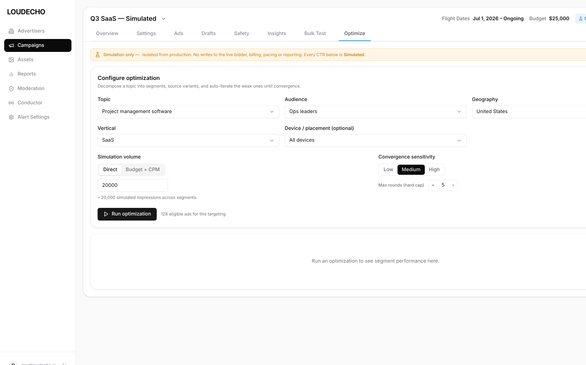
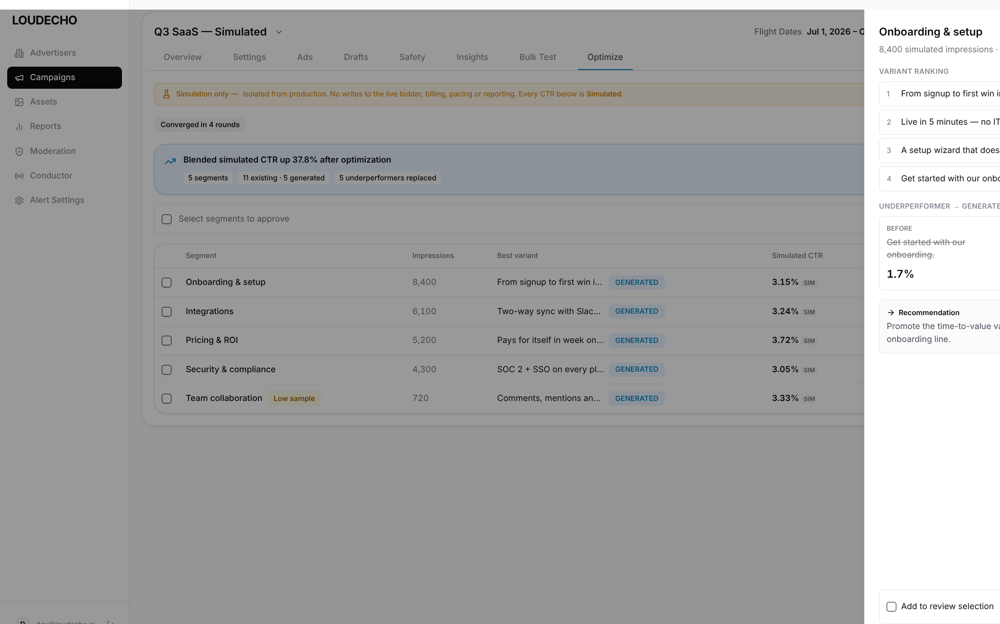
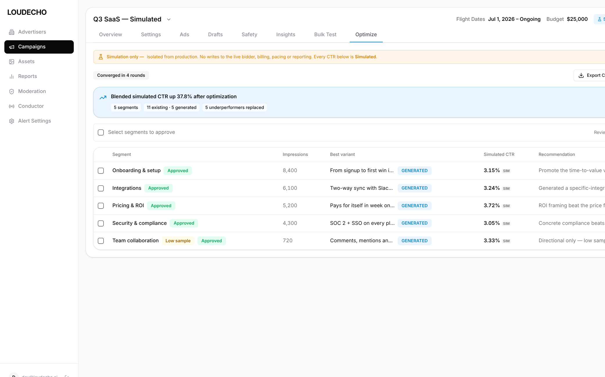

# Case Study · ENG-1409 — Creative Optimization Simulation (Build Arm)

| Field | Value |
|-------|-------|
| **Linear ticket** | [ENG-1409](https://linear.app/teza/issue/ENG-1409) — Creative Optimization Simulation |
| **Target repo** | dara-front (new **Optimize** tab on campaign detail) |
| **Experiment branch** | `ENG1409-Claude` |
| **Companion branch** | `ENG1409-Control` (planning-only critique) / `ENG1409-Paper` |
| **Workflow** | Grill-before-build — **build arm** (runnable interactive prototype slice) |
| **Date** | 2026-07-04 |
| **Status** | **BUILD** — runnable `prototype/` slice + live in-browser screenshots + build notes + design review |

---

## Executive summary

Where `ENG1409-Control` stopped at a build-ready PRD, this branch runs the **build arm**: it turns the same ticket into a **runnable interactive prototype slice** a developer can `npm run dev` and click through end to end. The slice implements the full loop — **Configure a run (topic → segments) → staged pipeline (Decompose → Source → Simulate → Optimize, round-by-round, converge-or-cap) → results (pinned insights + per-segment table) → drill into a segment (before/after CTR, variant ranking) → bulk-approve winners** — inside the real **dara-front** campaign shell, with an ever-present amber **isolation banner** and `SIM` labels on every number. The optimization is a deterministic client-side **simulation engine** with no network path, so it can never touch the live bidder by construction. The agent's strongest move was making simulation-safety structural (the engine literally cannot write to production) rather than cosmetic. The weakest point is that the engine uses seeded fixtures, so numbers are illustrative. **Verdict:** the build arm delivers a clickable, token-faithful, safety-framed slice that proves the converge-or-cap loop, and is ready to hand to a dev for dara-front integration against the real offline simulation service.

---

## The bet we were testing

The Control arm tested whether grilling produces a trustworthy PRD **before** code. The build arm tests:

1. **Can an agent build a runnable slice** that reproduces the dara-front **campaign detail** shell (sidebar, header, underline tabs, Sheet) faithfully?
2. **Can it model the real optimization loop** — staged pipeline that iterates weak segments and **stops on convergence or a round cap**?
3. **Can it make simulation-safety un-fakeable** — visibly and structurally isolated from the live bidder/billing/pacing/reporting?
4. **Can it prove the loop works** with live browser evidence across configure → run → results → drill-in → approve?

We did **not** test whether the feature is good business — only whether the build-arm workflow yields an interactive artifact a senior PM/PD would trust as a spec + showcase.

---

## Session narrative — pivotal build moments

### Moment 1 — Live shell as source of truth

No dara-front Figma file key was available, so the agent ran dara-front locally behind an **env-gated dev auth bypass** (see [`AUTH-BYPASS.md`](AUTH-BYPASS.md)) and captured the real campaign shell (`case-study/screenshots/_ref-dara-front-shell.png`). The Optimize tab was then built to slot into the real sidebar + campaign header + underline `TabMenu`.

### Moment 2 — Safety made structural, not cosmetic

The ticket's hardest constraint is "never touch production." The agent implemented this two ways: (a) a persistent amber **IsolationBanner** and `SIM` labels on every metric, and (b) a `runOptimization` **engine with no network path** — it physically cannot write to the live bidder. Safety is a property of the architecture, not a disclaimer.

### Moment 3 — Converge-or-cap as a real state machine

The optimize loop isn't a fake progress bar: `runOptimization` iterates rounds, replaces underperformers, re-simulates, and **stops on convergence or the max-round hard cap** — whichever comes first. The captured runs show both the live `round N / M` counter and the terminal `Converged in N rounds` badge.

### Locked build decisions (summary)

| ID | Decision | Rationale |
|----|----------|-----------|
| B1 | Vite + React + TS + Tailwind slice, dara-front tokens copied verbatim | Design-system fidelity without Next.js overhead |
| B2 | `Optimize` tab on campaign-detail `TabMenu` | Extends dara-front IA; adjacent to existing Simulation Mode |
| B3 | All pipeline behind `engine.ts` (no network) | Swap for offline simulation service; never the live bidder |
| B4 | Persistent isolation banner + `SIM`/`GENERATED` labels | Safety visible on every number |
| B5 | Right-anchored `Sheet` drill-down + bulk-approve → review queue | Matches dara-front `Sheet` + review patterns |

---

## Flow walkthrough (plain English)

### Happy path (5 steps)

1. Operator opens the **Optimize** tab on campaign detail (under the amber isolation banner).
2. **Configure:** decompose a topic into segments; set audience/geo/vertical/device; pick simulation volume (`Direct` impressions or `Budget + CPM`), convergence sensitivity (Low/Med/High), and a max-round hard cap. `Run optimization` shows eligible-ad count.
3. **Staged run:** stepper (Decompose → Source → Simulate → Optimize) + `Optimizing — round N / M`; read-only subtopic tree. Loop replaces underperformers and **stops on convergence or the cap**.
4. **Results:** `Converged in N rounds`, pinned insight (blended CTR uplift), per-segment table (best variant `GENERATED`, simulated CTR `SIM`, recommendation), `Low sample` warnings, Export CSV/JSON, Save snapshot.
5. **Drill-in + approve:** click a segment → **Sheet** (variant ranking, before/after CTR, recommendation); select segments → **Approve selected** into a review queue (rows flip to `Approved`).

### Error / empty branches (slice coverage)

- Empty results placeholder before first run.
- Cancel-run available mid-pipeline.
- Low-sample segments flagged rather than silently trusted.

---

## Interaction design — options considered and why the pick wins

| Step | Options | Pick | Why |
|------|---------|------|-----|
| Run termination | (a) fixed rounds (b) **converge-or-cap** | **b** | Stops early when stable; hard cap bounds cost |
| Volume input | (a) impressions only (b) **Direct \| Budget+CPM toggle** | **b** | Operators think in both; segmented control |
| Drill-in | (a) inline expand (b) **right-anchored Sheet** | **b** | Matches dara-front `Sheet`; keeps table context |
| Approval | (a) per-row only (b) **bulk select + approve** | **b** | Operators approve many winners at once |
| Safety | (a) label once (b) **persistent banner + `SIM` on every metric + no network engine** | **b** | Un-fakeable isolation from production |

---

## Screenshot review — live in-browser evidence + dara-front fidelity

All screenshots are **fresh captures of the running prototype** (`npm run dev`, port 5176), not wireframes.

### Screen 1 — Configure

*Campaign shell (sidebar `Campaigns` active, header `Q3 SaaS — Simulated` + flight dates + budget + sim badge), underline `TabMenu` with `Optimize` active, amber isolation banner, full configure card.*

| Element | Prototype | dara-front | Match? |
|---------|-----------|-----------|--------|
| Sidebar + campaign header | LOUDECHO, header w/ flight/budget | `Sidebar` + campaign header | ✅ Match |
| Underline `TabMenu` | Overview…Bulk Test, Optimize active | `TabMenu`/`LineTabs` | ✅ Match |
| `Optimize` tab | Net-new tab | No Optimize yet | 🟦 Extension |
| Isolation banner | Amber warning treatment | Simulation Mode banners | ✅ Pattern match |
| Config fields | `Select`, `Input`, segmented controls | `components/ui/*` | ✅ Match |

### Screen 2 — Staged run loop

*`Running · Optimizing — round 4 / 5`; stepper (Decompose ✓, Source ✓, Simulate ✓); read-only `Topic decomposition · Auto · read-only` subtopic tree.*

### Screen 3 — Results

*`Converged in 4 rounds`; pinned insight `Blended simulated CTR up 37.8%` + `5 segments · 11 existing · 5 generated · 5 underperformers replaced`; segment table with `GENERATED` tags, `SIM` labels, `Low sample` warning; Export / Save snapshot.*

### Screen 4 — Segment Sheet + bulk approve

*Right-anchored `Sheet`: variant ranking, `UNDERPERFORMER → GENERATED` before/after CTR, recommendation, add-to-review footer.*

*After bulk approve: all five segments flip to `Approved`.*

**Layout gate verdict:** **PASS** — all states render coherently and the full loop is clickable. Reference shell: `case-study/screenshots/_ref-dara-front-shell.png`.

---

## UX fidelity vs dara-front — honest codebase comparison

An honest comparison of the prototype against the real dara-front campaign-detail surface (the slice is a build-arm reproduction, so this is where it stands relative to production code):

| Surface / behavior | Real dara-front | This prototype | Honest verdict |
|--------------------|-----------------|----------------|----------------|
| Campaign shell (sidebar + header) | `Sidebar.jsx`, campaign header w/ flight dates + budget | Reproduced from live screenshots; verbatim tokens | ✅ Faithful — reads as the real shell |
| Tab strip | `TabMenu`/`LineTabs` underline pattern | Same underline + active token | ✅ Faithful; `Optimize` is a net-new tab slot |
| Simulation isolation | Existing **Simulation Mode** components (`SimulationModeCard`, `InputsPanel`, `StatusPanel`) + banners | New Optimize loop reusing the same amber banner treatment + `SIM` labels | 🟦 Extension — sits adjacent to Simulation Mode; a dev should reconcile shared banner/config components at integration |
| Drill-down | `Sheet` (right-anchored) used across dara-front | Same shadcn `Sheet` | ✅ Faithful |
| Results table | `Table` primitive + `Badge` | Same primitives + checkbox column | ✅ Faithful |
| Config inputs | `Select`, `Input`, segmented controls | Same primitives | ✅ Faithful |
| Data | Real Firebase/Postgres campaign + bidder-adjacent simulation | Seeded fixtures via `engine.ts` (no network) | ⚠️ Illustrative — numbers are simulated, sourcing is demo |
| Eligible-ad count | Real targeting query | Demo value | ⚠️ Lands at integration |

**Bottom line:** chrome, tabs, Sheet, and tokens are production-faithful; the optimization *data* is illustrative by design (safety), and the Optimize loop should be reconciled with the existing `SimulationMode/` components during dev integration.

---

## PRD resume (key sections)

Full detail in [`prd-resume.md`](prd-resume.md); build detail in [`case-study/04-build-notes.md`](case-study/04-build-notes.md); design review in [`case-study/05-design-review.md`](case-study/05-design-review.md).

- **What:** an `Optimize` tab on campaign detail that runs a **simulation** (never the live bidder) — configure → staged optimize loop → results → approve winners.
- **Merge notes:** add `Optimize` to campaign `TabMenu`; reuse `Table/Sheet/Select/Card/Badge/TabMenu` + Simulation Mode banner; replace `engine.ts` with the offline simulation service (hard constraint: no live-bidder path).
- **Out of scope:** any live-spend path, cross-campaign optimization, auto-apply without approval, real variant generation.

---

## What the agent got right — and wrong

### Right

- **Un-fakeable safety.** Persistent banner + `SIM` on every number + an engine with no network path — isolation is structural.
- **Real converge-or-cap loop.** `runOptimization` is a genuine staged state machine; both the live round counter and terminal convergence badge verified in-browser.
- **Design-system-true shell.** Reproduced campaign detail + underline tabs + `Sheet` from live screenshots; tokens copied verbatim.
- **Swappable seam.** All pipeline behavior in `engine.ts`; integration touches one file.
- **Full loop evidence.** `npm run build` passes; configure → run → results → Sheet → approve all captured live.

### Wrong / weak

- **Seeded fixtures.** Segment/variant numbers are illustrative, not real simulated data.
- **Sheet clipped at 1024px.** Right-anchored Sheet is partly off-screen in the captured viewport (functional, not a layout bug).
- **Eligible-ad counts are demo values.** Real sourcing lands at integration.
- **Convergence thresholds need tuning.** Sensitivity→threshold mapping is a documented dev follow-up.

---

## Critique verdict — is the build arm superb or subpar?

**Grade: A− / strong build-arm slice.**

**Evidence for "strong":** the loop is fully clickable and design-faithful; simulation-safety is architectural, not cosmetic; the engine seam makes integration a one-file swap; live screenshots prove every state.

**Evidence for "not superb yet":** seeded fixtures and demo eligible-ad counts mean the slice is UI- and logic-complete but not data-complete; threshold mapping needs tuning against real data.

**Would I hand this to a dev to integrate into dara-front?** **Yes** — with the `prd-resume.md` merge notes and `engine.ts` seam, integration is well-scoped, and the safety framing is a spec in itself.

---

## Ratings

| Dimension | Score (1–5) | Evidence |
|-----------|:-----------:|----------|
| **Workflow fidelity (steps 3–6)** | **5** | Runnable slice + merge notes + build notes + design review |
| **UI / design-system fidelity** | **5** | Real dara-front campaign shell, underline tabs, `Sheet`, verbatim tokens |
| **Interaction completeness** | **5** | Configure → converge-or-cap loop → results → Sheet → bulk approve, verified live |
| **Simulation-safety framing** | **5** | Banner + `SIM` labels + no-network engine (structural isolation) |
| **Overall build-arm grade** | **4** | Strong interactive slice; seeded fixtures + threshold tuning prevent a 5 |

---

## Appendix — artifact index

| Artifact | Path | Purpose |
|----------|------|---------|
| Prototype (runnable) | [`prototype/`](prototype/) | Vite+React+TS slice; `npm i && npm run dev` → :5175 |
| Prototype scope | [`prototype/README.md`](prototype/README.md) | In/out of scope, run, engine seam mapping |
| Build notes | [`case-study/04-build-notes.md`](case-study/04-build-notes.md) | Implementation loop + file map |
| Design review | [`case-study/05-design-review.md`](case-study/05-design-review.md) | Fidelity checklist + token compliance + ratings |
| PRD resume | [`prd-resume.md`](prd-resume.md) | Shape Up summary + dara-front merge notes |
| Auth bypass | [`AUTH-BYPASS.md`](AUTH-BYPASS.md) | Env-gated local dev bypass for dara-front `withAuth` |
| Screenshots | [`case-study/screenshots/`](case-study/screenshots/) | Live in-browser: configure, running, results, sheet, approved (+ shell ref) |

---

*This case study evaluates **build-arm output quality** — a runnable, design-faithful, safety-framed interactive slice — not whether the feature is the right product bet. The engine uses seeded fixtures; dara-front integration against the real offline simulation service is a separate dev pass.*
