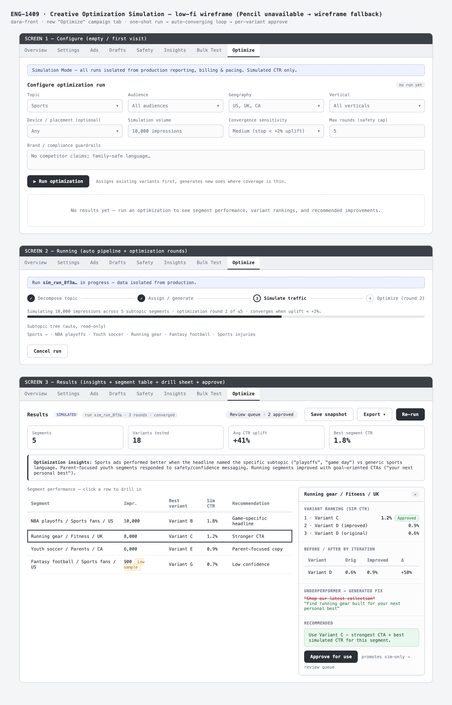

# PM Critique · ENG1409-Control

**Ticket:** [ENG-1409](https://linear.app/teza/issue/ENG-1409) — Creative Optimization Simulation  
**Repo:** dara-front · **Source branch:** `gavriel/ENG-1409-creative-optimization-simulation`  
**Workflow variant:** Control arm — standard grill-before-build  
**Audit date:** 2026-07-01  
**Phase:** Planning only (grill → flows → mock → PRD). **No build.**

> This document critiques **agent output quality**, not whether simulation-based creative optimization is the right product direction.

---

## Executive verdict

**Approve PRD — build first.** This is the cleaner of the two control-arm runs: smaller blast radius, stub backend explicit from the start, 12 ACs that map cleanly to grill decisions, and zero production contract touch. I'd prioritize this over ENG-1410 for the first build session.

| Dimension | Rating | One-liner |
|-----------|--------|-----------|
| Problem clarity | ✅ Strong | Extends existing Simulation Mode with clear wedge |
| Scope discipline | ✅ Good | Typed stub backend; convergence cap = safety |
| Buildability | ✅ High | Additive Optimize tab; mock seam documented |
| UX clarity | ✅ Strong | All six ticket outputs represented in results mock |
| Process friction | ⚠️ Low | Pencil unavailable; Q9 skipped → default adopted |

**Build readiness:** Yes — no structural blockers. PRD approval is the only gate.

---

## Workflow under test

| Step | Tool / skill | Outcome |
|------|--------------|---------|
| Context | Linear + Simulation Mode code read | Mapped InputsPanel, simulate-now, SimulatedGenerationsTable |
| Grill | `grill-me-product` style, 8 locked + 1 default | Decisions Q1–Q9 |
| Flows | Mermaid + state diagram + edge table | 10 edge/empty/error states |
| Mock | HTML → Playwright PNG (Pencil N/A) | 4 screens (configure, running, results, composite) |
| PRD | Shape Up + `prd-resume.md` | 12 ACs |

**What was NOT run:** build, design-review gate, Linear proof-of-work post.

---

## Output inventory

| Artifact | Path on this branch |
|----------|---------------------|
| Grill log | [`artifacts/grill-log.md`](artifacts/grill-log.md) |
| Flows & interactions | [`artifacts/flows.md`](artifacts/flows.md) |
| Mockup notes | [`artifacts/mockup-notes.md`](artifacts/mockup-notes.md) |
| PRD resume | [`artifacts/prd-resume.md`](artifacts/prd-resume.md) |
| Screenshots | [`artifacts/screenshots/`](artifacts/screenshots/) |

---

## Critique by artifact type

### Grill Q&A (Q1–Q9)

Eight decisions locked; Q9 (results presentation) skipped by operator → agent adopted **segment-drill** default. Acceptable under MVP stop rules.

**Standout decisions:**

| # | Decision | PM take |
|---|----------|---------|
| Q2 | New Optimize tab | Right surface — doesn't pollute existing Simulation Mode |
| Q3 | One-shot auto pipeline | Matches operator mental model ("run it, then review") |
| Q4 | Auto-converge + max rounds (5) | Good safety cap per agentic-discipline |
| Q7 | Typed mock/stub backend | Honest — keeps build in dara-front, zero prod leakage |
| Q8 | Per-variant Approve for use | Clear promotion semantics without live-campaign risk |

**Discipline note:** Blast radius Level 1 called out in grill log — isolated frontend, simulation-only. Correct.

**Weakness:** Skipped Q9 means results IA wasn't explicitly validated with the PM. Default (segment-drill) matches ticket intent and mock — low risk, but worth confirming in PRD review.

### Flows & diagrams

Strengths over ENG-1410 run:

- **Run lifecycle state diagram** (configure → running → converged → results)
- **Edge/empty/error table** with 10 states — unusually thorough for a planning session
- Happy path is 8 steps, matches ticket narrative

**Gap:** Export/snapshot flow is mentioned in defaults but not diagrammed. Minor.

### Wireframes & mocks

Pencil MCP **unavailable**. HTML wireframe + Playwright render. Layout gate: **PASS**.

#### Configure

*Optimize tab, isolation banner, config grid, Run CTA, empty results placeholder.*

**Critique:** Isolation banner and "Simulated CTR only" labeling visible upfront — satisfies hard requirement from ticket. Config grid reuses InputsPanel patterns (vertical/audience selectors exist).

#### Running

*Stepper, round counter, subtopic tree preview, Cancel.*

**Critique:** Communicates closed-loop iteration at a glance. "Round 2 of ≤5 · converges when uplift < +2%" is the right level of operator transparency.

#### Results

*Insights, segment table, drill sheet, Approve for use, Save/Export.*

**Critique:** All six ticket outputs represented (insights, segment table, variant ranking, before/after, underperformers+fixes, recommendation). Low-sample badge on thin segments — good. Drill sheet keeps table context.

#### Composite

*Single composite for quick scan.*

### PRD

See [`artifacts/prd-resume.md`](artifacts/prd-resume.md).

**Strengths:**

- 12 ACs covering configure, run, convergence, results, approve, export, isolation
- **Contract changes: none** to existing systems — only new TS types + `runOptimization()` seam
- CTR contract untouched (simulated CTR is its own labeled metric)
- Out of scope explicit: real backend, promote-to-live, editable subtopic tree

**Concerns:** None structural. PRD is ready for approval as-is.

---

## Gaps & risks

| Gap | Severity | Notes |
|-----|----------|-------|
| Pencil unavailable | Low | Wireframe fallback sufficient for layout gate |
| Q9 skipped | Low | Default adopted; mock validates segment-drill |
| Stub backend | Expected | Real sim engine is a later ticket — seam is documented |
| Linear proof-of-work | Low | Not posted yet |
| No build metrics | N/A yet | Rework comparison pending ship |

---

## Build readiness

| Question | Answer |
|----------|--------|
| Ready to build? | **Yes** |
| Recommended approach | `OptimizeTab/` component set + `mockOptimization.ts` + tab wiring behind `isSimulated` |
| Design gate | Required before PR — design skill stack + design-reviewer PASS |
| Contract risk | **None** — TS-only, simulation-isolated |

---

## Lessons for next run

1. **Stub backends belong in grill Q7** — this run did it right; replicate for similar features
2. **Edge-state tables** in flows doc are high value — keep requiring them
3. **Don't skip results IA questions** even when default is obvious — 30 seconds of PM confirmation beats rework
4. Build this **before** ENG-1410 — validates the workflow on a smaller surface

---

## What worked / what failed

| ✅ Worked | ❌ Failed / friction |
|-----------|---------------------|
| Simulation Mode code grounding | Pencil MCP unavailable |
| One-shot + auto-converge model locked early | Q9 skipped (low impact) |
| 12 ACs ↔ grill traceability | Linear sync not completed |
| Zero contract risk called out in PRD | No build yet |
| Segment-drill mock matches ticket outputs | |

---

*Control arm for ENG-1409. Cross-feature comparison: see main [`README.md`](../README.md).*
