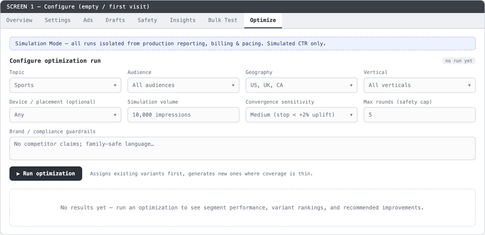
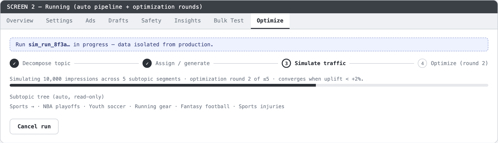
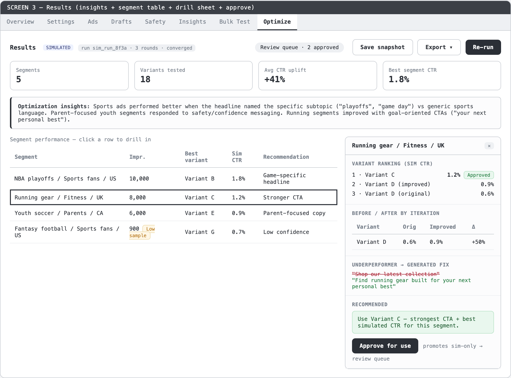

# Case Study · ENG-1409 — Creative Optimization Simulation

| Field | Value |
|-------|-------|
| **Linear ticket** | [ENG-1409](https://linear.app/teza/issue/ENG-1409) — Creative Optimization Simulation |
| **Target repo** | dara-front (admin dashboard; merges to `staging`) |
| **Source branch** | `gavriel/ENG-1409-creative-optimization-simulation` |
| **Experiment branch** | `ENG1409-Control` |
| **Workflow** | Grill-before-build (control arm) |
| **Date** | 2026-07-01 |
| **Status** | **PLANNING** — grill → flows → mock → PRD complete; build not started |

---

## Executive summary

We ran grill-before-build on ENG-1409 to test whether an agent could spec a **closed-loop creative optimization workflow** on top of dara-front's existing Simulation Mode — without touching production contracts. The session locked eight grill decisions plus one adopted default (Q9), produced two Mermaid diagrams plus a ten-row edge-state table, four wireframe screens, and a twelve-criterion PRD resume with an explicit typed-stub backend seam. The agent correctly identified Simulation Mode as the foundation (`InputsPanel`, `SimulationModeCard`, `SimulatedGenerationsTable`) and proposed a new **Optimize** tab gated on `isSimulated`. **Verdict:** this is the cleaner of the two control-arm runs — smaller blast radius, honest stub backend, and wireframes that mostly extend real dara-front patterns with identifiable gaps called out below.

---

## The bet we were testing

ENG-1409 extends Simulation Mode from campaign QA into an operator-controlled **creative optimization loop**: configure targeting → decompose topics into segments → assign/generate variants → simulate CTR → auto-iterate weak variants until convergence → review, approve, export. The experiment asked:

1. Can grilling produce a **one-shot auto pipeline** spec without over-scoping the backend?
2. Does the agent **read Simulation Mode code** before inventing UI?
3. Do wireframes **match dara-front tab patterns, banners, and shadcn primitives** — or invent a foreign dashboard?
4. Is isolation (`simulation_run_id`, simulated CTR labeling, zero prod leakage) **designed in**, not bolted on?

We evaluate **workflow output quality**, not whether simulation-based optimization is the right product direction.

---

## Session narrative — pivotal Q&A moments

Full transcript: [`artifacts/grill-log.md`](artifacts/grill-log.md). Format note: operator requested inline multiple-choice; Q9 was skipped → agent adopted the recommended default.

### Moment 1 — "All" scope with discipline (Q1)

**Asked:** Grill just the Results slice, or the full closed loop?

**Operator:** "all" — entire operator UI from config through promote.

**Locked:** Full closed-loop scope. Unlike ENG-1410's D1, this "all" is more justified: the feature **is** the loop — splitting config from results would produce an incoherent PRD. The agent compensated with Q7 (stub backend) to keep build in dara-front only.

### Moment 2 — Surface choice that respects existing IA (Q2)

**Recommended:** New **"Optimize" campaign tab** — single-page sectioned flow (Configure → Segments → Results → Optimize). Shown on simulated campaigns only.

**Operator:** Locked.

This matters because Simulation Mode today lives primarily on the **Overview tab** via `SimulationModeCard` (toggle + `InputsPanel` + `StatusPanel` + `SimulationHistory`). Bulk generation lives on the **Bulk Test** tab (`SimulationTab`). ENG-1409 adds a **third simulation surface** rather than overloading Overview — correct IA hygiene.

### Moment 3 — Backend honesty (Q7)

**Recommended:** Typed mock/stub data layer + documented API contract; real LLM/sim backend wired later.

**Operator:** Locked.

This prevented the classic planning failure: writing a PRD that implies backend exists. The PRD resume states `runOptimization()` as the seam. Blast radius stays Level 1 (isolated frontend).

### Moment 4 — Skipped Q9 → default adopted

**Q9 (results presentation)** was skipped by operator. Agent adopted **segment-drill**: segment performance table lead, click row → Sheet with variant ranking, before/after, fixes, recommendation.

**Risk:** PM didn't explicitly validate results IA. **Mitigation:** default matches Linear ticket narrative; wireframe screen 3 renders all six ticket outputs. Low risk — but worth confirming in PRD review.

### Locked decisions (Q1–Q9 summary)

| # | Decision | Rationale |
|---|----------|-----------|
| Q1 | Full closed-loop UI | Feature *is* the loop |
| Q2 | New **Optimize** tab on simulated campaigns | Doesn't pollute Overview or Bulk Test |
| Q3 | **One-shot** run — operator watches progress, reviews results | Matches "run it, then inspect" mental model |
| Q4 | **Auto-converge** until CTR uplift < threshold + **max 5 rounds** cap | Prevents runaway loops (agentic-discipline) |
| Q5 | Topic tree **auto during run, read-only** in results | No pre-flight editing complexity |
| Q6 | **Assign existing variants first**; generate where coverage thin | Respects campaign's current ad set |
| Q7 | **Typed stub** backend behind `runOptimization()` | Build now in dara-front; real engine later |
| Q8 | **Per-variant "Approve for use"** → badge + review queue | Deliberate promotion; no live-campaign risk |
| Q9 | **Segment-drill** (default) | Table + Sheet drill-down |

---

## Flow walkthrough (plain English)

Diagrams: [`artifacts/flows.md`](artifacts/flows.md).

### Happy path

1. Operator opens a **simulated campaign** and clicks the new **Optimize** tab.
2. **Configure** section: sets targeting dims (topic, audience, geo, vertical, optional device/placement), simulation volume, guardrails, convergence sensitivity. Clicks **Run optimization**.
3. System mints a `simulation_run_id` and streams progress: **Decompose → Assign/Generate → Simulate → Optimize (round N…)** until convergence or max rounds.
4. **Results** render: insights summary pinned on top; segment performance table below.
5. Operator **clicks a segment row** → right-side **Sheet** opens with variant ranking, before/after CTR by iteration, underperformer fixes, recommendation.
6. Operator **approves** winning variants per-row → Approved badge + Review queue count updates.
7. **Save snapshot** (full iteration history to simulation-only Firestore) and/or **Export** CSV/JSON.
8. Later: reopen saved run from history (read-only).

### Run lifecycle (state diagram)

Idle → Configuring → Running → (Decomposing → Sourcing → Simulating ⇄ Optimizing) → Complete → Reviewing → Saved. Failure at any engine stage → retry back to Configuring. The diagram makes the **Simulating ⇄ Optimizing loop** visible — important for operator trust in auto-convergence.

### Edge states (10 documented)

The flows doc includes an unusually thorough edge table: tab hidden on non-simulated campaigns, empty first visit, no ads (Run disabled), invalid config, low-sample amber badge (<1,000 impressions), running (config locked), no improvement, engine error, read-only snapshot, permission denied. Each maps to a UX response — rare for a planning session.

---

## Interaction design — options considered and why the pick wins

### K1 — Configure presentation

- **A (pick):** Inline collapsible section at top; collapses to summary chip after run.
- B: Left config rail + right results.
- C: Modal config.

**Why A:** One-page top-to-bottom flow; post-run the config collapses so results dominate. Matches how operators scan campaign tabs today.

### K2 — Progress display

- **A (pick):** Horizontal stepper (Decompose · Source · Simulate · Optimize ×N) with live round counter.
- B: Log/console stream.
- C: Single spinner.

**Why A:** Communicates the closed loop and iteration count — matches Q4 auto-converge model.

### K3 — Segment drill-down

- A: Expandable accordion row.
- **B (pick):** Right-side **Sheet** on row click.
- C: Full route change to segment sub-page.

**Why B:** Keeps segment table as context; gives variant detail room; **reuses shadcn Sheet** already in dara-front. No navigation loss.

### K4 — Approve affordance

- **A (pick):** Per-row "Approve for use" → Approved badge; Review queue chip summarizes count.
- B: Multi-select + toolbar.
- C: Star/favorite.

**Why A:** Matches hard requirement for deliberate per-variant approval (Q8).

### K5 — Before/after CTR

- **A (pick):** Two-column table (Original vs Improved + % change) per variant.
- B: Sparkline across iterations.
- C: Grouped bar chart.

**Why A:** Matches ticket's example tables exactly; sparkline is fast-follow.

---

## Wireframe review — screenshots

Pencil MCP **unavailable**. HTML wireframes → Playwright/Chromium PNGs. Structural fidelity only.

### Screen 1 — Configure (empty / first visit)

*New **Optimize** tab in campaign tab bar; isolation banner; config grid; Run optimization CTA; empty results placeholder.*

**What this proves:** Q2 (Optimize tab), Q3 (one-shot entry), isolation requirement visible upfront.

### Screen 2 — Running (auto pipeline)

*Run-id banner; horizontal stepper with round counter; subtopic tree preview; Cancel run.*

**What this proves:** Q4 (auto-converge + max rounds), K2 (stepper progress), Q5 (read-only tree preview).

### Screen 3 — Results + drill Sheet

*Insights callout; segment table with Low sample badge; Sheet with variant ranking, before/after table, Approve for use.*

**What this proves:** Q9 segment-drill default; all six ticket outputs represented; K3 Sheet; K4/K5 approve + before/after.

Mock notes: [`artifacts/mockup-notes.md`](artifacts/mockup-notes.md). Layout gate: **PASS**.

---

## UX fidelity vs dara-front — honest codebase comparison

This section compares wireframes against **real dara-front patterns**, not generic dashboard UX. Code references are from the planning-session codebase read.

### What matches well

| Wireframe element | Real dara-front pattern | Verdict |
|-------------------|-------------------------|---------|
| **Campaign tab bar** | `campaignTabs` array in `src/app/campaigns/[campaignId]/page.tsx` — Overview, Settings, Ads, Drafts, Safety, Insights, Bulk Test | ✅ Optimize as **new tab after Bulk Test** is correct extension; `isSimulated` gating already exists (ENG-1108) |
| **Isolation banner** | Overview uses amber banner: `border-amber-500/40 bg-amber-500/10` + "Simulated data" copy when `isSimulated` | ✅ Wireframe's "Simulation Mode — isolated from production" banner matches tone and placement |
| **Simulated CTR labeling** | Simulated metrics labeled throughout Simulation Mode | ✅ Wireframe labels CTR cells "SIMULATED" |
| **Vertical / audience selectors** | `InputsPanel.tsx`: shadcn `Select` for vertical; audience patterns exist | ✅ Config grid reuses selector **patterns** (build uses real Select, not wireframe boxes) |
| **Run disabled + reason** | `SimulationTab`: `runDisabledReason` when no ads / exceeds cap | ✅ Wireframe implies same guard pattern for "no eligible ads" |
| **Sheet drill-down** | shadcn `Sheet` used across dara-front | ✅ K3 pick aligns with component library |
| **Table + Badge** | `SimulatedGenerationsTable`, shadcn `Table`/`Badge` | ✅ Segment table + Low sample amber badge fit existing table density |
| **Bulk Test coexistence** | Bulk Test tab = fast fan-out QA; separate from optimization loop | ✅ Optimize tab doesn't replace Bulk Test — complementary surfaces |

### Gaps and divergences (call-outs for build)

| Gap | Evidence | Severity |
|-----|----------|----------|
| **Generic wireframe inputs** | Wireframe uses gray boxes; prod uses shadcn `Select`, `Label`, `TabsList`, `Input` with `text-muted-foreground` helper text | **Medium** — expected for layout gate; build **must** swap to InputsPanel-adjacent components |
| **Config dims broader than InputsPanel** | Real `InputsPanel`: vertical, audience, Direct/Budget+CPM volume. Wireframe adds Topic, Geography, Device/placement, Convergence sensitivity, Max rounds | **Low** — intentional feature extension per ticket; not a mismatch, but **not copy-paste InputsPanel** |
| **No SimulationModeCard on Optimize tab** | Today simulation toggle + inputs live on **Overview** via `SimulationModeCard` | **Low** — Optimize tab is net-new; should still **inherit visual language** from SimulationModeCard (Card wrapper, FlaskConical icon, spacing) |
| **Header "Simulation mode" badge** | Campaign header shows badge when `isSimulated` (`data-testid="campaign-detail-simulation-badge"`) | **Low** — wireframe shows tab-level banner only; build should show **both** header badge and tab banner for consistency |
| **Grayscale, no Tailwind tokens** | dara-front uses shadcn tokens + `surface-theme-*` classes in Overview | **Medium** — wireframe intentionally unstyled; design skill stack applies at build |
| **Progress stepper** | No existing optimization stepper in repo (net-new) | **N/A** — must be built from shadcn primitives; wireframe structure is reasonable |
| **Review queue chip** | No existing "review queue" UI | **N/A** — new affordance per Q8; should use `Badge` + `Button` variants consistent with campaign actions |

### Overall fidelity score

**IA/logic: 4/5** — Tab placement, isolation, Sheet drill-down, and table-first results align with dara-front conventions.

**Visual/component fidelity: 2/5** — Wireframes are correctly low-fi; they do **not** demonstrate token-accurate shadcn composition. Build step must read `SimulationMode/`, campaign tab shell, and design skill stack before JSX.

**Recommendation:** Approve wireframes as **layout gate only**. Require design-reviewer pass against real `InputsPanel` and campaign tab chrome before PR merge.

---

## PRD resume (key sections)

From [`artifacts/prd-resume.md`](artifacts/prd-resume.md):

### What

A new **"Optimize"** tab on simulated campaigns: one-shot creative-optimization closed loop — decompose topic → segment → assign/generate variants → simulate CTR → auto-iterate until convergence → review, approve, export.

### Why

Extends Simulation Mode from campaign QA into operator-controlled segment-level creative improvement **before** launch — no engineering support, no production risk.

### Acceptance criteria (12 locked)

1. Optimize tab visible only on `isSimulated` campaigns.
2. Configure captures dims, volume, guardrails, convergence, max-rounds; invalid config disables Run with reason.
3. Run streams staged progress; mints `simulation_run_id`.
4. Loop stops on CTR-uplift convergence OR max-rounds cap.
5. Read-only subtopic tree; each subtopic = segment.
6. Assign existing variants first; generate where thin; show source per variant.
7. Results: insights + segment table + Low-sample badge.
8. Segment click → drill Sheet: ranking, before/after, fixes, recommendation.
9. Per-variant Approve → badge + Review-queue count.
10. Save snapshot (full iteration history) + Export CSV/JSON.
11. Every metric labeled "Simulated"; isolation banner; no prod writes.
12. All edge states from flows §4 handled.

### Contract changes

**None to existing systems.** New internal TypeScript contract in `OptimizeTab/types.ts` + `runOptimization()` seam only. CTR contract (`pixel_impressions` denominator) untouched — simulated CTR is its own labeled metric.

### Out of scope

Real decomposition/generation/simulation backend; promoting variants to live campaigns; editable subtopic tree; cross-campaign optimization.

---

## What the agent got right — and wrong

### Right

- **Simulation Mode grounding before grill.** Mapped InputsPanel, simulate-now route, SimulatedGenerationsTable — didn't invent simulation from scratch.
- **Stub backend explicit (Q7).** PRD is honest about mock layer; no false backend dependency.
- **Safety caps (Q4).** Max 5 rounds + convergence threshold — agentic-discipline applied.
- **Edge-state thoroughness.** Ten-row error/empty table exceeds typical planning output.
- **Isolation by design.** `simulation_run_id`, simulated labeling, and banner in every mock screen.

### Wrong / weak

- **Q9 skipped.** Results IA adopted by default — acceptable but PM should confirm segment-drill vs alternatives.
- **Wireframes not component-faithful.** Generic boxes instead of shadcn Select/Sheet composition — layout-valid, visually divergent.
- **Export/snapshot not diagrammed.** Mentioned in defaults but absent from Mermaid — minor doc gap.
- **No build / design-review / Linear proof.** Planning audit only.

---

## Critique verdict

**Grade: A- / strong, build-first.**

This run is **cleaner than ENG-1410**: smaller blast radius, zero contract touch, stub seam documented, and wireframes that extend real tab/banner/Sheet patterns with honest gaps noted. I would **prioritize ENG-1409 for first build session** over ENG-1410.

**Would I approve this PRD?** **Yes** — after confirming Q9 default with PM. No structural blockers.

---

## Ratings

| Dimension | Score (1–5) | Evidence |
|-----------|:-----------:|----------|
| **Clarity added before build** | **5** | Q1–Q8 locked; 12 ACs map cleanly; stub backend removes backend ambiguity |
| **Grounding in design skill stack / IA / app logic** | **4** | Optimize tab + isSimulated gating + Sheet drill match dara-front; wireframes not token-faithful |
| **UX best practices / approach quality** | **4** | 5 interaction picks with rationale; 10 edge states; isolation designed in |
| **Build readiness** | **4** | Additive tab + typed mock; no prod contract work; design pass needed for component fidelity |
| **Overall workflow grade** | **4** | Best control-arm run; Q9 skip and wireframe styling gap prevent 5 |

---

## Appendix — artifact index

| Artifact | Path |
|----------|------|
| Grill log | [`artifacts/grill-log.md`](artifacts/grill-log.md) |
| Flows & interactions | [`artifacts/flows.md`](artifacts/flows.md) |
| Mockup notes | [`artifacts/mockup-notes.md`](artifacts/mockup-notes.md) |
| PRD resume | [`artifacts/prd-resume.md`](artifacts/prd-resume.md) |
| Screenshots | [`artifacts/screenshots/`](artifacts/screenshots/) — configure, running, results, composite |
| Full PRD | LoudEcho monorepo: `dara-front/docs/tasks/gavriel/ENG-1409-creative-optimization-simulation/prd.md` |

---

*This case study critiques **agent output quality**, not whether simulation-based optimization is good product. Planning-phase audit only.*
