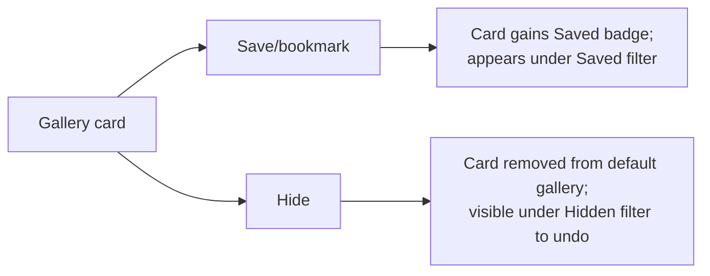

# 02 — Flows & Key Interactions · ENG-1410

**Repo:** echo-studio · **Branch:** `gavri/ENG-1410-creative-library`
Derived from locked decisions D1–D9 (see `01-grill-log.md`). Logic and journey only — no pixel/layout debate here.

---

## 1. User journey (happy path)

1. User opens **Library** (new nav item) → gallery of proven ad creatives (SeedProvider data).
2. User searches / filters by vertical, niche, platform, format, language, CTA, angle.
3. User selects a reference creative → opens **Concept Workspace**.
4. Workspace auto-runs **brand adaptation** against the **active brand** → generates a concept brief.
5. User **refines** the brief via the existing chat rail (tone, CTA, copy, visual style, etc.).
6. User is satisfied → clicks **Generate Variants**.
7. System creates a campaign+session, renders the concept, enqueues existing `surgical_edit` variant generation.
8. User is navigated to the existing **`/review`** surface where variants stream in. (Exit into existing workflow.)

---

## 2. End-to-end flow (Mermaid)

```mermaid
flowchart TD
    A([Enter Library /library]) --> B{Gallery has creatives?}
    B -- No / provider error --> B1[Empty or error state:\nretry / check provider]
    B -- Yes --> C[Browse gallery grid]
    C --> D[Search + filter\nvertical/niche/platform/format/lang/CTA/angle]
    D --> E{Results?}
    E -- none --> E1[Empty results:\nclear filters CTA]
    E1 --> C
    E -- yes --> F[Select a reference creative]
    F --> G[Open Concept Workspace /library/:id]
    G --> H{Active brand set?}
    H -- No --> H1[Block with inline brand picker]
    H1 --> I
    H -- Yes --> I[Auto-run adaptation once\nreference meta + Brand DNA -> concept_from_brief]
    I --> J{Adaptation ok?}
    J -- error --> J1[Error state in brief pane\nRetry adapt]
    J1 --> I
    J -- ok --> K[Show concept brief\nname/hook/message/visual/layout/CTA/copy/rationale]
    K --> L[Refine via chat rail]
    L --> M{Refinement mutates brief?}
    M -- yes --> K
    M -- switch brand --> I
    K --> N[Click Generate Variants]
    N --> O[Create/reuse campaign + session\nrender concept (concept_executor, parent_concept_id)]
    O --> P[Enqueue surgical_edit variant gen]
    P --> Q([Navigate to /review — variants stream in])
```

## 3. Curation sub-flow (Save / Hide) — Mermaid



---

## 4. Key interactions — 2–3 options each + recommendation

### 4.1 Gallery browse & preview
- **Option A (rec):** Responsive card grid; each card = thumbnail/video-poster, brand, format+platform badges, one-line concept summary, hover reveals key metadata + Save/Hide. Click card → open workspace.
- Option B: Dense table/list with a side preview panel.
- Option C: Masonry with inline video autoplay on hover.
- **Recommendation: A** — matches existing shadcn card patterns (`studio/components/gallery/`), scannable, cheap to build.

### 4.2 Search + filter
- **Option A (rec):** Left filter sidebar (facets: vertical, niche, brand, platform, format, language, CTA type, creative angle) + top keyword search; filters are URL query params (shareable, back-button safe).
- Option B: Top filter bar with dropdown popovers, no sidebar.
- Option C: Command-palette style search only.
- **Recommendation: A** — URL-param facets fit the App Router pattern already used by `/review?view=`; supports deep links.

### 4.3 Reference → adapted concept presentation (workspace)
- **Option A (rec):** Two-pane: left = reference creative (media + source metadata) stacked above the generated brief; right = chat rail. Brief rendered as labeled sections (Name, Hook, Core message, Visual direction, Layout, CTA, Copy blocks, Rationale).
- Option B: Tabs (Reference | Brief | Chat) — one thing at a time.
- Option C: Reference as a collapsible header; brief + chat side by side.
- **Recommendation: A** — keeps the source visible while refining; reuses existing `ChatRail`.

### 4.4 Refinement mechanism
- **Option A (rec):** Reuse the **existing global chat rail** scoped to this concept's session; natural-language edits ("make the CTA punchier", "shift tone to premium") re-render the brief in place.
- Option B: Structured form fields per brief section with inline "improve with AI" buttons.
- Option C: Hybrid — chat + quick-action chips (Tone, CTA, Audience, Format).
- **Recommendation: A** (with C's quick-action chips as a cheap enhancement if time allows) — leverages the production chat/SSE stack; least net-new code.

### 4.5 Generate Variants handoff
- **Option A (rec):** Primary CTA in workspace header; on click → create campaign+session → render concept → enqueue `surgical_edit` → toast + auto-navigate to `/review`.
- Option B: Stay in workspace, embed a variant results strip (net-new UI).
- Option C: Open `/review` in a new tab, keep workspace open.
- **Recommendation: A** — reuses `/review`, zero net-new variant UI, clear "you've left the concept, go watch it cook" mental model.

---

## 5. States to cover in the mock
- **Empty:** no creatives from provider; no filter results; no active brand (picker).
- **Loading:** gallery skeleton; adaptation skeleton in brief pane; variant enqueue spinner.
- **Error:** provider fetch failure (retry); adaptation failure (retry); variant enqueue failure (toast + stay).
- **Success:** populated gallery; generated brief; refined brief; navigation to `/review`.

---

## 6. Data contract sketch (for PRD, confirmed at build)

**Normalized library creative** (`library_creatives` table, new):
`id, source_provider, source_id, brand_name, vertical, niche, platform, format, language, cta_type, ad_copy, transcript, landing_url, thumbnail_url, media_url, creative_angle, emotional_drivers[], duration_s, is_live, usage_permissions, saved (bool), hidden (bool), ingested_at, raw_json`

**Concept** (reuse existing `concepts` + `concept_from_brief` shape): add `parent_library_creative_id` to trace lineage back to the source reference; `parent_concept_id` already carries forward into variants.

---

_Next: Pencil mock of Gallery + Concept Workspace (+ key states), screenshots to `case-study/screenshots/`._
