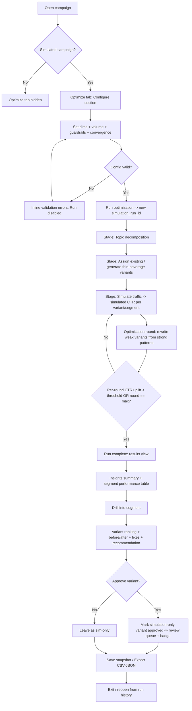
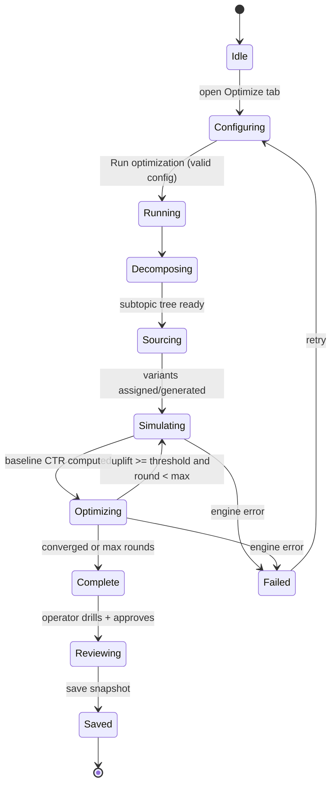

# 02 — Flows & Interactions · ENG-1409 Creative Optimization Simulation

Derived from locked grill decisions (see `01-grill-log.md`). Logic/flow only — no pixel debate.

**Surface:** new **"Optimize"** tab on the campaign detail page (simulated campaigns only).
**Model:** one-shot run → auto pipeline → review → per-variant approve. Auto-converging optimization loop with a hard max-rounds safety cap.

---

## 1. User journey (happy path)

1. Operator opens a simulated campaign → clicks **Optimize** tab.
2. **Configure** section: sets targeting dims (topic, audience, geo, vertical, optional device/placement), simulation volume, brand/compliance guardrails, convergence sensitivity. Clicks **Run optimization**.
3. **Progress**: live stepper streams stages — Decompose → Assign/Generate → Simulate → Optimize (round N…) — until convergence or max rounds.
4. **Results**: insights summary pinned on top; segment performance table below.
5. Operator **drills into a segment** → sees per-segment variant ranking, before/after CTR by iteration, underperformers + generated fixes, recommended variant.
6. Operator **approves** winning/generated variants per-variant → approved variants get a badge + enter the review queue.
7. Operator **saves snapshot** (full iteration history preserved) and/or **exports** CSV/JSON.
8. Exit: return later via run history to reopen a saved snapshot (read-only).

---

## 2. End-to-end flow (Mermaid)

## 3. State flow (run lifecycle)

## 4. Edge / empty / error states

| State | Trigger | UX |
|-------|---------|----|
| Tab hidden | Non-simulated campaign | Optimize tab not rendered (matches existing `isSimulated` gating) |
| Empty (no run yet) | First visit | Configure section + empty results placeholder ("Run an optimization to see segment performance") |
| No ads | Campaign has no eligible ads | Run disabled + reason ("Add at least one ad to optimize"), mirrors Bulk Test pattern |
| Invalid config | Missing/invalid volume or dims | Inline field errors; Run disabled |
| Low sample | Segment simulated impressions < threshold (1,000) | Amber "Low sample" badge on segment row + tooltip; recommendation shown but flagged low-confidence |
| Running | Pipeline in progress | Live stepper with current stage + round counter; Run button → "Running…"; config locked |
| No improvement | Optimization can't beat baseline | Segment recommendation = "Keep current best; no improvement found"; before/after shows 0% change |
| Engine error | Stub/back-end failure | Destructive alert with retry; partial results (if any) preserved, labeled incomplete |
| Read-only snapshot | Reopened saved run | All actions disabled except Export; banner "Saved snapshot — read-only" |
| Permission | `canWrite` false | Run + Approve disabled with permission reason; results viewable |

## 5. Key interaction decisions (2–3 options each + pick)

### K1 — Configure section presentation
- A. Inline collapsible section at top of tab **(pick)** — consistent with single-page flow; collapses to a summary chip after run.
- B. Left config rail + right results.
- C. Modal config launched by a button.
> Pick A: keeps the one-page top-to-bottom flow; post-run it collapses into a "Run config" summary the operator can expand to re-run.

### K2 — Progress display during the one-shot run
- A. Horizontal stepper (Decompose · Source · Simulate · Optimize ×N) with a live round counter **(pick)**.
- B. Log/console stream of events.
- C. Single indeterminate spinner.
> Pick A: communicates the closed loop clearly, shows iteration count (matches convergence model), low cognitive load.

### K3 — Segment → variant drill-down
- A. Expandable row (accordion) revealing the variant detail in place.
- B. Right-side drawer/sheet when a segment row is clicked **(pick)**.
- C. Full route change to a segment sub-page.
> Pick B: keeps the segment table as context, gives the variant ranking + before/after + fixes room in a sheet; no navigation loss; reuses shadcn Sheet.

### K4 — Approve action affordance
- A. Per-row "Approve for use" button that flips to an "Approved" badge **(pick)**; approved set summarized in a "Review queue (N)" chip.
- B. Checkbox multi-select + toolbar Approve.
- C. Star/favorite toggle.
> Pick A: explicit, matches the hard requirement that approval is deliberate per variant; badge + queue chip make promotion state legible.

### K5 — Before/after CTR presentation
- A. Two-column table (Original vs Improved + % change) per variant **(pick)** — matches ticket's example tables exactly.
- B. Small sparkline per variant across iterations.
- C. Grouped bar chart per segment.
> Pick A for MVP fidelity to the ticket; sparkline (B) is a fast-follow enhancement.

---

## 6. Simulation-only / isolation cues (always visible)

- Persistent "Simulated" label on every CTR/metric cell and a tab-level "Simulation Mode — data isolated from production" banner.
- Approved variants badged "Approved (sim)" until a separate promotion step (out of scope here) moves them live.
- `simulation_run_id` shown in the run config summary + snapshot header.
