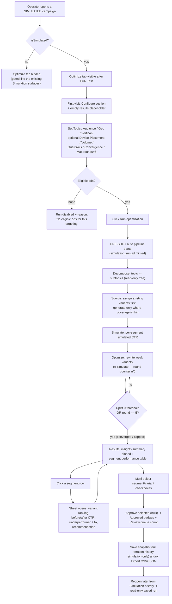
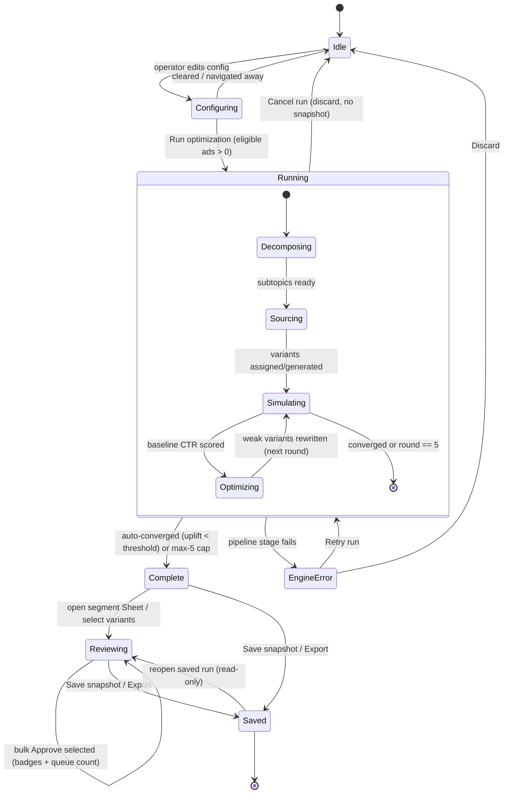

# 02 — Flows & Interactions · ENG-1409 Creative Optimization Simulation (Pencil arm)

**Repo:** dara-front (merges to `staging`)
**Branch:** `gavriel/ENG-1409-creative-optimization-simulation-pencil`
**Surface:** new **Optimize** campaign tab (simulated campaigns only), single-page sectioned flow — Configure → Segments → Results → Optimize.
**Scope basis:** locked grill decisions Q1–Q8 (see `01-grill-log.md`). Backend is DEFERRED (Q6) — flows describe UX and illustrative data only.

---

## Happy-path flow (entry → configure → run → staged pipeline → results → bulk approve → save/export → reopen)

Entry gating reuses the existing `isSimulated` pattern (`campaign.v2Options.campaignData.isSimulated`) that already gates simulated-only affordances in `src/app/campaigns/[campaignId]/page.tsx`; the Optimize tab is appended to the `campaignTabs` array right after `bulk-test`, conditionally on `isSimulated`.

---

## Run-lifecycle state diagram

The `Running` composite mirrors the four visible stepper stages (Decompose · Source · Simulate · Optimize ×N). The `Simulating ⇄ Optimizing` self-loop is the closed loop; it terminates on auto-converge OR the hard max-5-rounds cap (agentic-discipline runaway guard).

---

## Key interaction decisions

### K1 — Configure presentation (inline sectioned vs modal wizard vs separate route)
- **Options:** (a) inline config section at the top of the Optimize tab, results below; (b) modal/drawer wizard that must be dismissed to see results; (c) a dedicated `/optimize` route.
- **Pick: (a) inline sectioned config**, collapses to a compact summary once a run exists.
- **Rationale:** Q2 locked a single-page sectioned flow. Inline config keeps the whole loop on one surface (density > drama, per loudecho-brand product mode) and matches the existing `InputsPanel` pattern inside `SimulationModeCard` where inputs and status share one card. A modal would hide the results context the operator is iterating against; a separate route fragments the loop.

### K2 — Progress display during the one-shot run (horizontal stepper vs log stream vs single spinner)
- **Options:** (a) horizontal 4-stage stepper with a live round counter; (b) verbose scrolling log of every action; (c) one indeterminate spinner + "Working…".
- **Pick: (a) horizontal stepper** (Decompose · Source · Simulate · Optimize ×N) with a `round n / 5` chip and a Cancel run button.
- **Rationale:** Q3 is a one-shot auto pipeline the operator *watches*. A stepper gives staged, legible progress and makes the closed loop visible (the round counter communicates the auto-iterate behavior and the max-5 cap) without the noise of a raw log. Reuses the register of the existing `StatusPanel` running state (status pill + live counter), extended to stages.

### K3 — Segment drill-down = Sheet (side Sheet vs inline expanding row vs full navigation)
- **Options:** (a) right-side Sheet overlay; (b) inline accordion row expansion; (c) navigate to a per-segment page.
- **Pick: (a) shadcn `Sheet` from the right**, opened by clicking a segment row; row highlights while open.
- **Rationale:** Q7 locked segment-first results with a Sheet drill-down. A Sheet keeps the segment table (the operator's map) in context while showing dense per-segment detail (ranking + before/after + fix + recommendation). Accordion rows would blow up row height and break the scannable table; a separate page loses the comparison context. `Sheet` is already an installed primitive.

### K4 — Bulk-approve affordance (multi-select toolbar vs per-row button vs auto-promote)
- **Options:** (a) row checkboxes + a toolbar "Approve selected" + Review-queue count chip; (b) an Approve button on every row; (c) auto-promote winners with a veto.
- **Pick: (a) multi-select + toolbar bulk action.** *(Deliberate divergence from the control arm's per-variant approve — Q8.)*
- **Rationale:** operators approve many segments per run; per-row approval is high-friction at 5+ segments and N variants. A select-then-approve toolbar with a live "Review queue: N" chip and an "Approved" badge is the standard bulk pattern (mirrors the Drafts tab's multi-select + Publish (N) toolbar already in the campaign shell), and preserves an explicit human approval gate (no silent auto-promote — approval stages within Simulation Mode only, never to live).

### K5 — Before/after CTR presentation (side-by-side compare vs delta-only vs sparkline)
- **Options:** (a) two-column Original vs Improved with a bold % change; (b) show only the +% uplift; (c) a per-round line chart.
- **Pick: (a) two-column Original vs Improved + a `+31%` delta chip**, both values labeled Simulated.
- **Rationale:** Q7 explicitly calls for before/after CTR in the Sheet. Two columns make the improvement legible at a glance and keep the "Simulated CTR only, not real performance" caveat attached. A delta-only value hides the baseline; a per-round chart is over-built for MVP (non-goal: per-round metric history UI) and CTR is the sole MVP metric.

---

## Edge / empty / error-state table

| # | State | Trigger | UX response |
|---|-------|---------|-------------|
| 1 | Tab hidden | Campaign is not simulated (`isSimulated === false`) | Optimize tab is not rendered in `campaignTabs` at all — no disabled/ghost entry. Same gating pattern as existing simulated-only affordances. |
| 2 | Empty first visit | Optimize tab opened, no run for this campaign yet | Configure section shown expanded + a dashed empty-results placeholder ("No optimization run yet — configure and Run"). Primary CTA is Run optimization. |
| 3 | Run disabled — no eligible ads | Targeting yields zero eligible ads | Run optimization button disabled; inline reason next to it ("No eligible ads for this targeting — adjust targeting or add ads"). No run is minted. |
| 4 | Low-sample segment | A segment received < ~1,000 simulated impressions | Amber "Low sample" badge on the Impressions cell; CTR shown with an asterisk and de-emphasized; Sheet recommendation = "re-run with more volume"; segment excluded from convergence weighting. |
| 5 | No variant coverage for a segment | A subtopic has no eligible existing variant and generation is thin | Segment row shows a muted "Coverage thin — generated 1" note; source tag = Generated; still simulated but flagged in the Sheet. |
| 6 | Auto-converged early | Per-round uplift < threshold before round 5 | Pipeline stops at round n; insights summary reads "converged in n of 5 rounds"; stepper shows Optimize complete. |
| 7 | Max-rounds cap hit | 5 rounds run without converging | Stops at round 5; insights note "reached max rounds (5) — uplift still improving"; recommendation suggests a longer/again run. Prevents runaway (agentic-discipline). |
| 8 | Engine / stage error | A pipeline stage fails mid-run | Stepper marks the failed stage; inline error banner (destructive) with the failed stage + Retry run / Discard. Partial results are NOT shown as final; run stays non-Complete. No prod side effects. |
| 9 | Cancel run | Operator clicks Cancel run while Running | Confirm, then discard the in-flight run (no snapshot, run id released); return to Configure with prior config preserved. |
| 10 | Nothing selected on bulk approve | "Approve selected" clicked with 0 selected | Button disabled until ≥1 row selected; tooltip "Select at least one segment/variant to approve". |
| 11 | Already-approved rows | Some selected rows were approved in a prior action | "Approved" badge persists; re-approving is a no-op; Review-queue count reflects only still-pending approvals. |
| 12 | Save with no changes / re-open saved run | Operator reopens a saved snapshot | Loads read-only: config summary, full iteration history, results, and approval state; topic tree read-only; controls (Run/Approve) disabled with "Saved snapshot (read-only)". |
| 13 | Isolation always-on | Any state | Amber isolation banner present in every state; simulated CTR always carries the "Simulated"/SIM label; `simulation_run_id` chip shown once a run exists; zero writes to live bidder / billing / pacing. |

---

*Next: mockups in Paper (3 artboards) + `03-mockup-notes.md`. PRD is intentionally NOT written yet — operator reviews the mocks first.*
