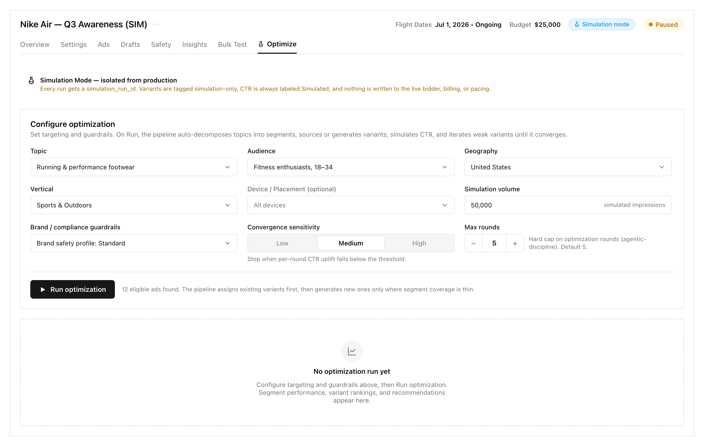
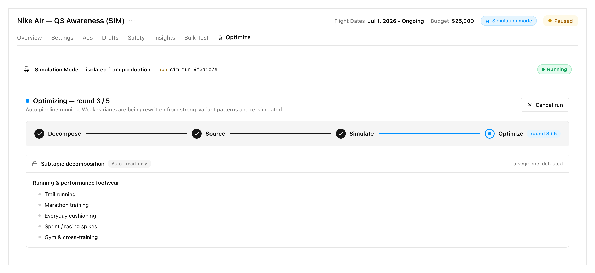
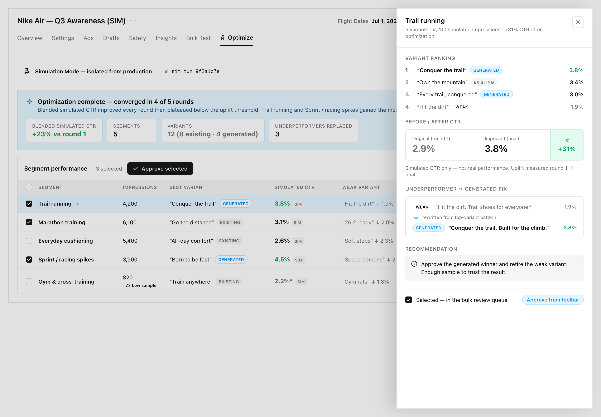

# 03 — Mockup Notes · ENG-1409 Creative Optimization Simulation (Pencil arm)

**Repo:** dara-front · **Branch:** `gavriel/ENG-1409-creative-optimization-simulation-pencil`
**Surface mocked:** new **Optimize** campaign tab (simulated campaigns only).

## Tool

- **Mockup tool = Paper (Paper MCP / Paper Desktop).**
- **Operator override:** the arm folder/branch is named "…-pencil" and the arm was originally scoped for **Pencil**. During the grill the operator said **"lock it"** (grill closed at Q1–Q8) and **"use Paper instead of Pencil"** for the mockups. These mocks were therefore built in Paper, not Pencil. This override is recorded here (and noted in the grill context) so the branch name's "pencil" suffix is not misread.
- **Design system:** LoudEcho tokens were recreated as Paper design tokens (Inter type, `--foreground #0A0A0A`, `--muted-foreground #737373`, `--border #E5E5E5`, `--primary #171717`, `--accent #0090FF`, `--success #0A9C55`, `--status-live-*`, plus an amber isolation set `--amber* `). Type is **Inter** (dara-front canonical) confirmed available via `get_font_family_info`; `Geist Mono` used only for the `simulation_run_id` chip.

## Paper file / artboards

- **File used (active):** "ENG-1410 Creative Library — Paper arm" (`01KWER6EXVBRSY43Q8TF1N0PYX`).
- **Artboards (1440px desktop):**
  - `01 · Configure (first visit)`
  - `02 · Running (auto pipeline)`
  - `03 · Results + drill Sheet (bulk approve)`
- **Screenshots (exported PNG @2x):**
  - `screenshots/01-configure.png`
  - `screenshots/02-running.png`
  - `screenshots/03-results.png`

> **Paper MCP quirk (flagged):** `create_file` returned a fresh file id ("ENG-1409 Optimize — Pencil arm (Paper)", `01KWERDE5Z2P5HXYW28AG88SSR`) and `open_file` reported it active, but subsequent `create_artboard`/`write_html` mutations landed in the already-open "ENG-1410 Creative Library" document (the desktop app kept that file focused). The three Optimize artboards therefore live alongside the ENG-1410 artboards in that file; the freshly-created ENG-1409 file remained empty. All three artboards render correctly with the LoudEcho tokens. One transient `Node not found` was returned during an autosave/version tick and resolved on retry. None of this affects the deliverable screenshots. If a standalone ENG-1409 Paper file is required, the artboards can be moved/duplicated into `01KWERDE5Z2P5HXYW28AG88SSR`.

---

## Per-screen notes (real dara-front components referenced)

### 01 · Configure (first visit)

- **Campaign shell + tab bar:** replicates `src/app/campaigns/[campaignId]/page.tsx` — campaign name + `⋯` menu, Flight Dates / Budget, the **`Badge` variant="low"** "Simulation mode" chip with **`FlaskConical`** icon (exact pattern from the header), and the status pill. Tab bar mirrors the `TabMenu` underline style; the new **Optimize** tab is appended **after Bulk Test** and would be gated by `isSimulated` in the `campaignTabs` array.
- **Isolation banner:** amber, matching the existing `border-amber-500/40 bg-amber-500/10` register, `FlaskConical` + the "isolated from production" copy lifted from `SimulationModeCard`'s description.
- **Config card:** a single `Card` with a `FormSection`-style header and a field grid. Fields map to shadcn **`Select`** triggers (Topic, Audience, Geography, Vertical, Device/Placement) — same register as `InputsPanel`'s vertical `Select` — plus a numeric **`Input`** (Simulation volume, echoing `InputsPanel`'s impressions input), a segmented control (Convergence sensitivity) and a stepper (Max rounds = 5).
- **CTA:** primary `Button` "Run optimization" (near-black `--primary`, per loudecho-brand — not blue), with the eligible-ads note beside it (edge state 3).
- **Empty results:** dashed placeholder `Card` (edge state 2).

### 02 · Running (auto pipeline)

- **Run-id banner:** isolation banner + a `simulation_run_id` chip (`Geist Mono`) + a **`Badge` variant="live"** "Running" pill (the `STATUS_META.running` mapping from `StatusPanel`).
- **Run panel:** header "Optimizing — round 3 / 5" + a **Cancel run** outline `Button` (register of `StatusPanel`'s Stop button).
- **Stepper:** horizontal Decompose · Source · Simulate · Optimize ×N with completed check circles (`--primary`), an active accent node, and a `round 3 / 5` chip (K2).
- **Subtopic tree preview:** read-only bordered list with a lock icon + "Auto · read-only" chip (topic tree is auto + read-only in MVP; non-goal: editable tree).

### 03 · Results + drill Sheet (bulk approve)

- **Complete banner:** isolation + run-id chip + **Export CSV / JSON** (outline `Button`) and **Save snapshot** (primary `Button`, matching `StatusPanel`'s Save snapshot → `SaveRunDialog`).
- **Insights summary (pinned top):** accent-soft callout with headline + metric chips (blended simulated CTR +23%, segments, variants split existing/generated, underperformers replaced) — Q7 pinned insights.
- **Segment performance `Table`:** columns Segment / Impressions / Best Variant / Simulated CTR (SIM label) / Weak Variant / Recommendation, styled like `SimulatedGenerationsTable`. Source tags **GENERATED / EXISTING** (Q5), `SIM` label on every CTR value, an amber **Low sample** `Badge` on the Gym row (edge state 4), and an **Approved** `Badge` (`variant="live"` register) on a completed row.
- **Bulk approve toolbar (Q8 — divergence):** row checkboxes + "· 3 selected" + primary **Approve selected** action + a **Review queue: 5** count chip (mirrors the Drafts tab's multi-select + `Publish (N)` toolbar).
- **Drill-down `Sheet` (shown open):** right-anchored shadcn **`Sheet`** with a dimming scrim over the table; contains Variant ranking, a **Before / After CTR** two-column compare (Original 2.9% vs Improved 3.8% + `+31%`), the **underperformer → generated fix** (strikethrough weak copy → rewritten generated copy with CTRs), a **Recommendation** block, and a selection footer tying the segment into the bulk review queue.

---

## Wireframe fidelity self-check

**Nav / tab placement matches the real product?** Yes. The header (name + `⋯`, Flight Dates, Budget, "Simulation mode" `Badge` + `FlaskConical`, status pill) and the underline `TabMenu` reproduce `campaigns/[campaignId]/page.tsx`. The Optimize tab is placed **after Bulk Test**, consistent with the locked decision and the real `campaignTabs` ordering (Overview · Settings · Ads · Drafts · Safety · Insights · Bulk Test · **Optimize**). In build it must be conditionally appended on `isSimulated` (the same boolean already used for the header sim badge).

**Isolation banner / badges match existing patterns?** Yes. Amber isolation banner uses the established amber tint register; the "Simulation mode" badge, "Running" live badge, and "Approved" badge all map to real `Badge` variants (`low`, `live`) and the `StatusPanel` `STATUS_META` labels. Every simulated CTR carries a `SIM` label and the `simulation_run_id` is surfaced as a mono chip — matching the hard-isolation contract.

**What the mock simplifies vs what build must implement (honest gaps):**
- **Illustrative data only (Q6 deferred).** All CTRs, segments, variant copy, round counts and the `+23% / +31%` upfts are hand-authored. No engine, no Firestore/Postgres wiring, no real decomposition/generation/simulation. Build must decide real-vs-stub and wire `simulation_run_id`, per-segment/per-variant simulated CTR, and iteration history.
- **Static states, not interactions.** The stepper, checkboxes, Sheet, and bulk-approve are painted in one representative state (round 3/5; 3 selected; Trail running Sheet open; one Approved; one Low sample). Loading/hover/focus/disabled/error transitions, the Cancel-run confirm, the engine-error banner, and re-open-read-only are described in `02-flows-and-interactions.md` but not drawn.
- **Fields are display mocks.** `Select`/`Input`/stepper are visual only — no options lists, validation, or the real vertical fetch (`/url-verticals`) that `InputsPanel` performs.
- **Convergence + low-sample thresholds are illustrative** (Medium sensitivity, ~1,000-impression low-sample line). Exact values are tunable at build.
- **Approval is staging-only.** The mock shows "Approved" / review queue; build must ensure approval stages variants *within Simulation Mode* and never promotes to a live campaign (non-goal).
- **Not real component instances.** Paper frames approximate `Card`/`Table`/`Select`/`Badge`/`Sheet`/`Tabs`; build uses the actual shadcn primitives + LoudEcho custom components with real tokens from `globals.css`.

## Layout gate verdict

**PASS.** All three artboards render at 1440px desktop width with correct product-register density: consistent vertical lanes across the segment table, aligned config field grid, legible type hierarchy (Inter, 11–18px), token-driven color (near-black primary, `#0090FF` accent, amber isolation, green success/live), no clipping (`fit-content` on 01/02; fixed 1000px on 03 to host the full-height Sheet + scrim), and no LoudEcho anti-patterns (no hero gradient, no blue CTA, no nested cards, no side-stripe borders). This is a layout/fidelity gate only — no build design-review was run because nothing is implemented yet.
